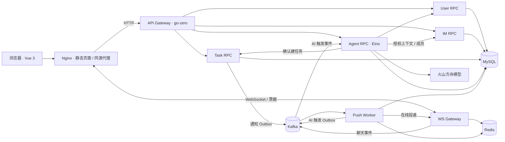

# JoeySpace

**从团队讨论到任务协作的 Go 微服务平台，配有 TypeScript / Vue 3 桌面 Web 前端。**

JoeySpace 将团队、聊天、任务、通知和 AI 助手放在同一个工作流程中：先阅读讨论，再处理自己的任务；需要整理待办时，在群里显式请求 AI，审查生成的草稿后逐项创建任务，并将结果回传到原群。

这是一个个人全栈项目，后端以 Go、go-zero、gRPC 和 Eino 为核心，前端使用 Vue 3 与 Vite，运行于 Docker Compose。第一版核心功能已实现，并完成云端真实浏览器和跨服务链路验收。当前部署入口经 SSH 隧道访问，未提供公开演示站点；AI 模型稳定性及部分故障专项仍有验证边界，见[验收记录](docs/frontend-f6-review.md)。

[架构说明](docs/architecture.md) · [运行与部署](deploy/README.md) · [前端开发](frontend/README.md) · [HTTP 接口](api/README.md) · [文档导航](docs/README.md)

## 可以做什么

| 能力 | 当前实现 |
| --- | --- |
| 用户与团队 | 注册、登录、本人资料；后端提供团队创建、成员管理、角色与本人退出接口 |
| 即时沟通 | Vue 团队群与已有私聊目录、文本收发、历史分页、断线重连、离线补拉 |
| 消息关注 | 按会话汇总未读、普通成员结构化提及、`@我` 筛选、显式标记已读 |
| 任务协作 | 我的任务、团队筛选、人工创建、负责人和期限、状态变更、返回来源讨论 |
| 任务通知 | 持久通知列表、逐条已读、WebSocket 实时提示后重读权威记录 |
| AI 助手 | 当前群只读问答、群内 `@AI` 整理 1—5 项草稿、逐项编辑/确认/跳过、机器人回帖与回帖重试 |

Vue 优先覆盖“看讨论 → 处理任务 → 审查 AI 草稿”的日常流程。团队创建、添加成员、角色和退出等管理操作目前通过 HTTP API 完成；完整管理后台、音视频、文件协作、移动端全量适配不在第一版范围内。

## 一个完整的协作流程

1. 准备两个账号，将它们加入同一团队与团队群。
2. 在 Vue 消息页讨论工作，查看未读和提及消息。
3. 发送 `@AI 整理任务`，从自己的原消息打开 AI 处理状态。
4. 核对草稿的来源、标题、说明、负责人和截止时间，逐项确认或跳过。
5. 确认后的任务进入“我的任务”，机器人将任务结果回传到群里。
6. 更新任务状态，在通知列表查看结果，并按需返回原讨论。

模型只生成建议。创建任务需要用户确认；任务创建结果、机器人回帖受理和消息已读分别记录，不把模型输出当成执行成功。

## 架构概览



图中展示主要链路，完整的服务职责、数据归属和三条消息流见[架构说明](docs/architecture.md)。User、IM、Task、Agent 按业务拆分；WS 与 Push 负责接入和投递。当前 Compose 共用一个 MySQL 实例和 `go_im` 库，各业务服务负责自己的表；**聊天消息仍由 Push 消费 Kafka 后写入**，IM 提供消息读取与权限契约。

## 工程实现

| 关注点 | 实现方式 |
| --- | --- |
| 服务边界 | Gateway 解析 HTTP 并调用 RPC，业务服务核对资源权限；Agent 经业务 RPC 读取和操作数据 |
| 重试与重复请求 | 消息 `msg_id` 去重、任务请求键、草稿版本检查、逐项确认与独立回帖状态 |
| 异步可靠性 | 持久 Outbox / Inbox、Kafka 消费确认、有限重试、后台任务租约和失败终态 |
| 权限变化 | 当前团队/群资格复核、离队代际与关闭记录、专用内部 mTLS 入口 |
| 浏览器一致性 | 单次 WS 票据与 Origin 限制；读取历史不自动已读；切群/换账号丢弃旧请求结果 |
| 数据精度 | HTTP 和浏览器中的大整数 ID 使用十进制字符串；时间使用 Unix 毫秒 |

这些机制用于控制重复执行和恢复不确定结果，不声称消息系统具有端到端 exactly-once 保证。

## 技术栈

| 层次 | 技术 |
| --- | --- |
| 前端 | TypeScript 5.9、Vue 3、Vue Router、Vite 8；原生 CSS 与局部状态 |
| HTTP / RPC | Go 1.26.1、go-zero、gRPC / Protobuf；保留 Gin 兼容 API |
| Agent | Eino、火山方舟 ChatModel，受权限约束的消息与任务工具 |
| 实时与存储 | gorilla/websocket、Kafka / kafka-go、Redis 7、MySQL 8 / GORM |
| 运行 | Docker Compose、Nginx 多阶段前端镜像、JWT、内部专用 mTLS |

依赖的具体锁定版本见 [go.mod](go.mod) 和 [frontend/package.json](frontend/package.json)。

## 快速开始

推荐先在自己的 Linux / Docker 环境启动基础后端和正式 Vue 页面，再按需启用 AI 与专用投递链。需要 Docker Engine 与 Compose 插件；在 Windows 使用 Docker Desktop 时，证书路径和 shell 命令按[部署指南](deploy/README.md)处理。

```sh
git clone https://github.com/Joey0v0/JoeySpace.git
cd JoeySpace/deploy
test -e .env || cp .env.example .env
test -e docker-config.local.yaml || cp docker-config.yaml docker-config.local.yaml
```

先在 `.env` 填 `MYSQL_ROOT_PASSWORD` 和 `JWT_SECRET`，再在 `docker-config.local.yaml` 填相同数据库凭证与 `jwt.secret`。全新空卷自动执行 `mysql/init.sql`；已有数据卷先备份并按实际结构执行缺失迁移，不能重跑初始化代替升级。

```sh
docker compose --env-file .env \
  -f docker-compose.yaml -f docker-compose.frontend.yaml config --quiet
docker compose --env-file .env \
  -f docker-compose.yaml -f docker-compose.frontend.yaml up -d --build
```

在运行 Docker 的电脑打开 **http://127.0.0.1:18083/login**。若 Docker 运行于远程服务器，先在自己的电脑建立隧道，保持终端连接，再打开同一地址：

```sh
ssh -N -L 18083:127.0.0.1:18083 '<user>@<server>'
```

基础组合用于先检查登录、页面与基础 API，**不包含完整团队群投递、结构化提及、AI 回帖、实时任务提示和退出链**。体验完整流程需要准备模型接入点、机器人资料、独立证书和私有配置，再加载全部覆盖文件；具体命令与准备顺序见[完整功能部署](deploy/README.md#完整功能部署)。已有完整部署每次操作都要保留同一组覆盖文件。

新注册账号不会自动拥有团队，需通过[团队 API](api/README.md#准备团队与群聊)准备数据。旧的 `http://127.0.0.1:8082/demo/chat` 保留作后端诊断页，正式工作界面在 Vue 中。

## 开发与验证

Go 直接开发需要 Go 1.26.1；前端本地推荐 Node.js 24，前端容器使用 Node.js 22 构建。

```sh
# 仓库根目录：后端与诊断页测试
go test ./...
node --test examples/*.test.cjs

# frontend 目录：正式前端
cd frontend
npm ci
npm test
npm run build
```

`npm run build` 包含 TypeScript 类型检查。开发页面用 `npm run dev`，其 API / WS 代理目标见[前端指南](frontend/README.md)。单独构建静态文件不会提供后端数据。

截至 2026-10-10 的记录：全仓 Go 测试、Vue 133 项测试与构建通过；真实双账号浏览器验证了聊天、任务/通知、AI 草稿成功链、撤权和 Push 进程恢复。AI 请求曾间歇失败，整机/数据库崩溃恢复与物理中文输入法等专项未覆盖。证据和限制见[前端验收](docs/frontend-f6-acceptance-checklist.md)与[后端验收](docs/stage7-acceptance.md)，不以历史通过记录保证新的部署环境可用。

## 代码与文档入口

```text
JoeySpace/
├── frontend/          # Vue：登录、消息、任务、通知、AI 审查
├── api/               # go-zero HTTP Gateway
├── rpc/
│   ├── user/          # 用户与团队
│   ├── im/            # 消息读取、群权限、专用内部入口
│   ├── task/          # 任务、操作记录、通知与 Outbox
│   └── agent/         # Eino、运行、草稿、触发 Inbox / Worker
├── cmd/               # api（Gin）、ws、push、agent 的进程入口
├── internal/          # WS / Push、存储、认证及公共组件
├── deploy/            # Compose、Dockerfile、Nginx、SQL、验证脚本
├── examples/          # 嵌入 Gateway 的原生诊断页面
└── docs/              # 架构、设计、接口契约与验收记录
```

想了解实现，先读[架构说明](docs/architecture.md)，再进入对应服务 README；想运行项目，先读[部署指南](deploy/README.md)。[文档导航](docs/README.md)按用途索引资料，开发阶段编号和历史讨论集中在项目计划及契约文档中。

## License

MIT
