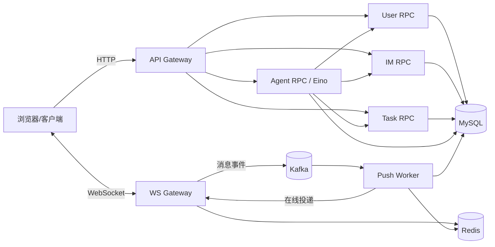
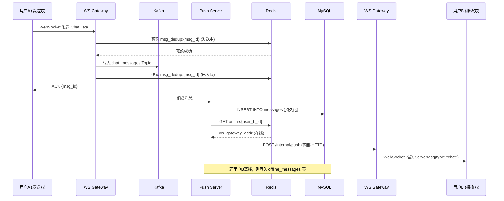

# JoeySpace：Go 微服务协作平台与 Agent

一个面向小团队协作的 Go 微服务项目，提供用户与团队、单聊与团队群、任务协作、通知和 AI 助手。HTTP 由 API Gateway 接入，业务通过 go-zero/gRPC 分为 User、IM、Task、Agent 服务；实时消息使用 WebSocket、Kafka、Redis 和 MySQL。Agent 使用 Go 与 Eino，支持接入火山方舟／豆包模型。

项目功能代码与部署模板已提供。部署者按[快速开始](#快速开始)准备自己的数据库凭证、JWT 密钥、模型接入点和服务证书；已有数据库还需按实际版本升级。自动化测试及部分隔离 MySQL、HTTP 和浏览器链路已通过，完整部署仍需在目标环境验收。功能边界见[项目方案](docs/project-plan.md)，验收范围见[阶段 7 清单](docs/stage7-acceptance.md)。

## 架构



## 核心特性

- **业务微服务**：User 管用户与团队，IM 管消息与访问资格，Task 管任务与通知，Agent 管 AI 运行和草稿；Gateway 统一提供新 HTTP 入口。
- **Agent 任务链**：群内指令可生成待审查草稿，由本人逐项确认或跳过，创建成功后以机器人身份回帖。
- **任务与消息未读**：任务状态通知、团队群和单聊均有本人显式确认入口；客户端不能把读取历史或离线 ACK 当成已读。
- **接入与实时服务**：HTTP API、WebSocket Gateway 与 Push Worker 分别负责请求接入、长连接和异步投递
- **发送请求去重**：客户端生成 `msg_id`，WS 网关借助 Redis 限制重复入队；Kafka/Push 重试仍可能重复在线推送，接收端按 `msg_id` 去重
- **离线消息拉取**：用户离线时消息写入 offline_messages 表，上线后通过 API 拉取
- **Kafka 削峰解耦**：WS 网关收到消息后写入 Kafka，Push 服务异步消费，避免网关阻塞
- **在线状态管理**：Redis 存储 `online:{user_id} → ws_addr`，心跳刷新 TTL，支持精准路由
- **群聊扇出推送**：Push 服务逐成员在线检查并推送/离线存储；团队群接收名单按当前 MySQL 成员资格查询
- **JWT 认证**：API 和 WS 连接均使用 JWT Token 鉴权
- **Snowflake ID**：消息 ID 使用 Snowflake 算法生成，天然有序
- **结构化日志**：Zap + Lumberjack，关键业务节点带 Context 字段输出
- **Docker Compose 部署**：基础服务与可选 Agent、机器人、群内触发、通知、团队退出覆盖分别配置；私有凭证和证书不入库

## 技术栈

| 组件 | 技术选型 |
|------|---------|
| 语言 | Go 1.26.1 |
| HTTP 框架 | go-zero Gateway、Gin API |
| 服务通信 | gRPC / Protobuf |
| Agent 编排 | Eino |
| WebSocket | gorilla/websocket |
| ORM | GORM + MySQL 8.0 |
| 缓存 | Redis 7 (go-redis) |
| 消息队列 | Kafka (kafka-go) |
| 认证 | JWT v5 |
| 配置 | Viper、go-zero 配置 |
| 日志 | Zap + Lumberjack |
| ID 生成 | Snowflake |
| 容器化 | Docker + Docker Compose |

## 项目结构

```text
go-im/
├── cmd/
│   ├── api/main.go              # HTTP API 进程入口
│   ├── ws/main.go               # WebSocket 网关入口
│   └── push/main.go             # 异步推送服务入口
├── api/                          # go-zero API Gateway
├── rpc/user/                     # 用户与团队 gRPC 服务
├── rpc/im/                       # 消息与群组 gRPC 服务
├── rpc/task/                     # 任务与通知 gRPC 服务
├── rpc/agent/                    # Agent gRPC 服务
├── internal/
│   ├── config/                  # 配置加载
│   ├── model/                   # GORM 数据模型
│   ├── handler/                 # HTTP Handler（Gin）
│   ├── service/                 # 业务逻辑层
│   ├── repository/              # 数据访问层（MySQL + Redis）
│   ├── ws/                      # WebSocket 网关核心逻辑
│   ├── push/                    # 推送服务逻辑
│   ├── middleware/              # Gin 中间件
│   └── pkg/                     # 公共组件（JWT、响应、错误码、雪花ID、日志）
├── config/go-im.yaml            # 本地开发配置
├── deploy/
│   ├── docker-compose.yaml      # 容器编排
│   ├── Dockerfile               # 多阶段构建
│   ├── docker-config.yaml       # 脱敏容器配置模板
│   ├── api-gateway.yaml         # API Gateway 容器配置
│   ├── user-rpc.yaml            # 用户 RPC 容器配置
│   ├── docker-compose.*.yaml    # 可选能力覆盖文件
│   ├── .env.example              # 私有环境变量模板
│   └── mysql/                   # 新库初始化与旧库增量迁移
├── Makefile
└── README.md
```

## 快速开始

以下是部署者需要填写的**环境信息**，不是缺失的项目源码。[详细部署配置](deploy/README.md)说明证书、服务地址和增量迁移；[最终验收清单](docs/stage7-acceptance.md)说明应观察的业务结果。先确认 Docker Compose 可用。

1. 进入 `deploy`，从模板复制私有文件；已有文件保持原样，不覆盖：

```bash
cd deploy
test -e .env || cp .env.example .env
test -e docker-config.local.yaml || cp docker-config.yaml docker-config.local.yaml
```

Windows PowerShell 的对应复制命令见[部署配置说明](deploy/README.md#凭证与云端原文件的区别)。在 `.env` 填数据库密码、JWT 密钥及各服务 ID；在 `docker-config.local.yaml` 填相同的数据库凭证和 JWT 密钥。根目录的 `config/go-im.yaml` 是本地开发配置，不作为生产凭证文件。**旧 MySQL 数据卷应沿用实际数据库密码**，改 `.env` 不会替它修改数据库密码。私有文件已被 Git 和 Docker 构建上下文排除，不要提交。

2. 数据库：全新空卷由 `mysql/init.sql` 初始化；已有数据卷先备份、核对实际表结构和已执行迁移，再按[验收清单](docs/stage7-acceptance.md#3-最终启动前核对全部待执行)执行尚缺的 `mysql/migrations`。不要对已有库重跑 `init.sql`，也不要执行 `down -v`。

3. 先校验基础配置，再启动不含 Agent 的基础服务：

```bash
docker compose --env-file .env -f docker-compose.yaml config --quiet
docker compose --env-file .env -f docker-compose.yaml up -d --build
docker compose --env-file .env -f docker-compose.yaml ps
```

Gateway 的聊天演示页位于 `http://localhost:8082/demo/chat`。基础启动**不会**启用 Agent、机器人回帖、后台 `@AI`、实时任务提醒及团队退出的专用证书链。要启用完整业务，先在 `.env` 填方舟 `ARK_API_KEY`/`ARK_MODEL_ID` 和各覆盖文件要求的私有证书目录，在私有 YAML 启用相应角色，并完成所需迁移；然后合并 `docker-compose.bot.yaml`、`docker-compose.trigger.yaml`、`docker-compose.notifications.yaml`、`docker-compose.team-leave.yaml` 与 `agent` profile。先运行合并后的 `config --quiet`，再使用**同一组参数**执行 `up -d --build`。具体证书用途、开关与顺序见[部署配置说明](deploy/README.md)和[阶段 7 验收清单](docs/stage7-acceptance.md)。

在上述前提全部满足后，可于 `deploy` 目录用 Linux shell 检查并启动完整组合：

```bash
docker compose --env-file .env --profile agent \
  -f docker-compose.yaml -f docker-compose.bot.yaml -f docker-compose.trigger.yaml \
  -f docker-compose.notifications.yaml -f docker-compose.team-leave.yaml config --quiet
docker compose --env-file .env --profile agent \
  -f docker-compose.yaml -f docker-compose.bot.yaml -f docker-compose.trigger.yaml \
  -f docker-compose.notifications.yaml -f docker-compose.team-leave.yaml up -d --build
```

4. 用至少两个账号实际验证登录、团队群聊天、任务、`@AI` 草稿审查与回帖、通知和重连查询。只有这些部署环境验证通过，才能称该环境的项目已完整运行；仓库中的本地测试结果不能替代它们。

本地代码回归可运行：

```bash
go test ./...
node --test examples/*.test.cjs
```

`Makefile` 的 `run-*` 只覆盖三个聊天进程，`docker-up` 只加载基础 Compose；两者都不代表上述可选能力已启用。

## HTTP 与 WebSocket 接口示例

下表展示 `:8080` 的 HTTP 接口；Gateway 入口与 Agent/任务接口见 `api/` 和相应契约文档。

### 用户模块
| 方法 | 路径 | 说明 |
|------|------|------|
| POST | `/api/v1/user/register` | 用户注册 |
| POST | `/api/v1/user/login` | 用户登录 |
| GET | `/api/v1/user/info` | 获取用户信息 |

### 好友模块
| 方法 | 路径 | 说明 |
|------|------|------|
| POST | `/api/v1/friend/add` | 发送好友申请 |
| POST | `/api/v1/friend/accept` | 同意好友申请 |
| GET | `/api/v1/friend/list` | 获取好友列表 |

### 群组模块
| 方法 | 路径 | 说明 |
|------|------|------|
| POST | `/api/v1/group/create` | 创建群组 |
| POST | `/api/v1/group/join` | 加入群组 |
| GET | `/api/v1/group/list` | 我的群组列表 |
| GET | `/api/v1/group/members` | 获取群成员 |

### 消息模块
| 方法 | 路径 | 说明 |
|------|------|------|
| GET | `/api/v1/message/offline` | 拉取未确认的离线消息，不删除 |
| POST | `/api/v1/message/offline/ack` | 处理后用字符串消息 ID 确认，格式见[迁移说明](docs/im-migration.md) |
| GET | `/api/v1/message/history` | 历史消息（游标分页） |

### WebSocket
- 连接地址：`ws://host:8081/ws?token=<JWT_TOKEN>`
- 上行消息格式：`{"type": "chat", "data": {"msg_id": "...", "to_id": 123, "chat_type": 1, "content_type": 1, "content": "hello"}}`
- 下行消息格式：`{"type": "ack", "data": {"msg_id": "..."}}` / `{"type": "chat", "data": {...}}`

## 单聊消息时序图



## 统一响应格式

```json
{
    "code": 0,
    "msg": "success",
    "data": {}
}
```

- `code = 0` 表示成功
- `code != 0` 对应 `internal/pkg/errcode` 中定义的业务错误码

## License

MIT
