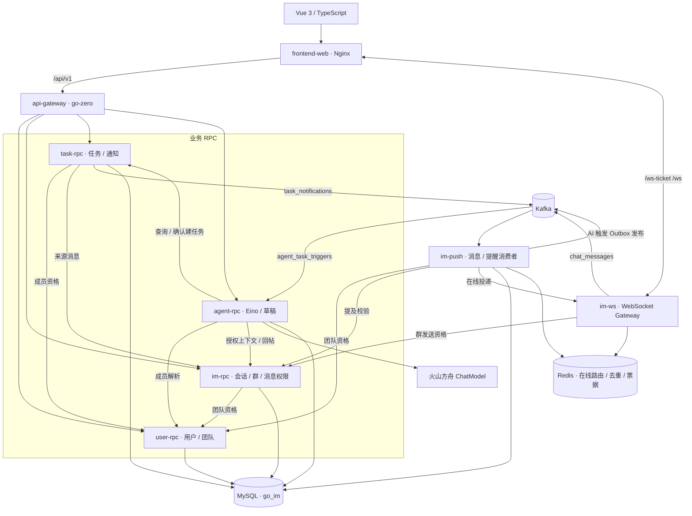
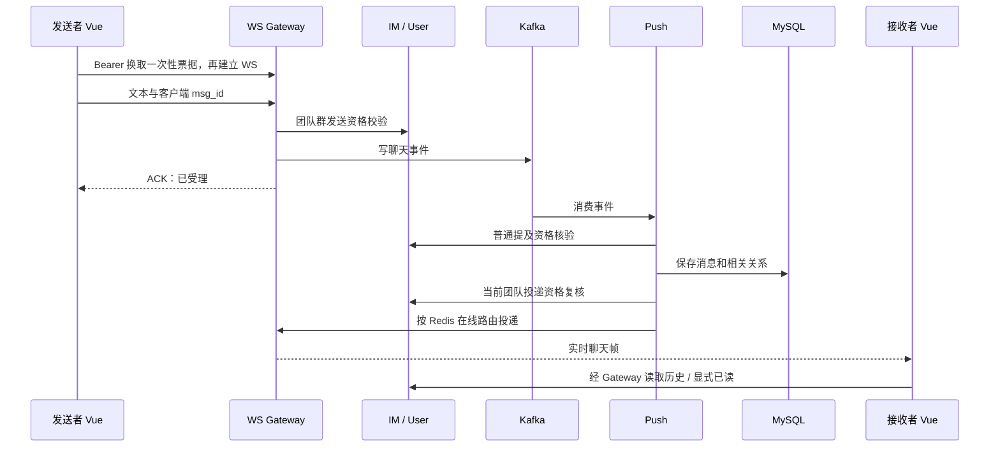
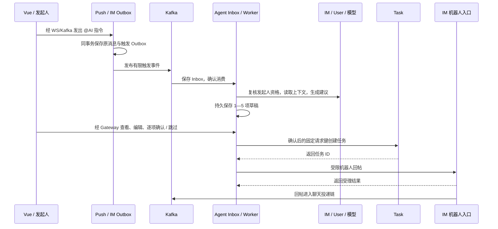

# JoeySpace 架构说明

本文描述当前实现，包含 Vue 前端、Go 微服务和 Docker Compose 部署。它是读代码前的架构入口；各项历史取舍见[架构决策](architecture-decisions.md)，运行步骤见[部署指南](../deploy/README.md)。

## 1. 从页面到服务

JoeySpace 的核心流程是“读团队讨论 → 整理或创建任务 → 更新状态 → 收到通知”。Vue 提供桌面浏览器工作区，业务数据和权限由后端决定。

图中的 RPC 包含普通本人请求和独立内部调用。普通链携带 Bearer Token，由资源所属服务核对访问权；后台触发、机器人回帖、团队退出、投递核权和提及使用各自的受限内部契约，其中专用链通过 mTLS 鉴别服务身份。当前普通 RPC 在 Compose 内网通信，不把全部 RPC 描述为已启用 mTLS。

## 2. 组件职责

| 组件 | 入口 / 目录 | 负责什么 |
| --- | --- | --- |
| Vue 工作区 | `frontend/src` | 登录、会话导航、历史与未读、任务/通知、AI 草稿审查与失败反馈 |
| Nginx | `deploy/frontend-nginx.conf` | 托管 `dist`，SPA 深链回退，HTTP 与 WebSocket 同源代理 |
| API Gateway | `api/main.go` | HTTP 校验、Token 转发、RPC 组合及错误映射，不直接访问业务数据库 |
| User | `rpc/user/main.go` | 身份与团队成员事实、角色、成员资格版本、本人退出操作 |
| IM | `rpc/im/main.go` | 团队群/私聊目录、授权历史、未读/已读、来源核验、机器人与后台受限入口 |
| Task | `rpc/task/main.go` | 任务创建、指派/期限、状态更新、操作记录、个人通知与通知 Outbox |
| Agent | `cmd/agent/main.go` + `rpc/agent` | 只读问答、草稿生成/保存/编辑/决策、触发 Inbox、后台租约和回帖状态 |
| WS Gateway | `cmd/ws` + `internal/ws` | 认证票据、Origin、心跳/连接租约、发送受理、实时消息和提醒帧 |
| Push Worker | `cmd/push` + `internal/push` | 消费聊天事件、持久化消息、在线投递/离线保存、提及与接收人资格复核、提醒消费 |
| Gin 兼容 API | `cmd/api` + `internal/handler` | 保留已有用户/好友/群接口；离线读取/ACK 转发到 IM，不是 Vue 的主要 HTTP 入口 |

业务 RPC 是服务边界，WS / Push 是接入和异步投递组件。Docker Compose 用独立容器运行它们；Agent 容器只有显式启用 `agent` profile 才启动。

## 3. 数据归属与部署现状

当前部署共用一个 MySQL 实例和 `go_im` schema，没有按服务分物理数据库。服务拥有各自的业务 Repository；Agent 通过 RPC 读取消息、成员和任务，不直接读写这些服务的业务表。

| 数据 | 所属业务 |
| --- | --- |
| `users`、`teams`、`team_members`、`user_team_leave_operations` | User：身份、团队、资格代际和退出协调 |
| `groups`、`group_members`、`messages`、`offline_messages`、群/私聊阅读凭据、提及关系、群关闭记录 | IM：会话与消息；当前消息/离线记录由 Push 写入，IM 提供授权读取 |
| `im_bots`、`im_bot_sends`、`im_agent_trigger_outbox` | IM：机器人受理与消息触发依据；触发 Outbox 与消息保存同事务，由 Push 进程发布 |
| `tasks`、`task_operations`、`task_status_notifications`、`task_notification_outbox` | Task：任务状态和通知事实 |
| `agent_runs`、`agent_task_drafts`、`agent_task_replies`、`agent_task_trigger_inbox` | Agent：持久运行、逐项草稿/回帖和后台触发状态 |

Redis 保存临时运行数据，例如 WS 在线地址与连接租约、发送去重预约和一次性票据。数据库历史与阅读凭据才是浏览器恢复状态的依据。

Kafka 默认使用三个独立 Topic：

| Topic | 发布方 | 消费方 | 内容 |
| --- | --- | --- | --- |
| `chat_messages` | WS；机器人受理入口 | Push | 普通聊天或机器人回帖的消息事件 |
| `agent_task_triggers` | Push 中的 IM Outbox 发布器 | Agent Inbox | 已持久消息派生的有限 AI 触发依据 |
| `task_notifications` | Task Outbox 发布器 | Push 通知消费者 | 任务变化后的实时提示依据 |

## 4. 普通聊天：受理、持久化、投递

单聊没有团队群权限调用；群内普通提及会先校验目标，再与消息一同提交。群投递逐接收人核对当前团队资格与群关闭版本；离线或在线投递失败时保存离线依据，之后由客户端拉取和确认。

需要区分三个结果：WS ACK 表示事件已受理；持久历史证明消息已落库；显式已读记录证明本人确认。离线 ACK 仅清除本人的投递依据。Kafka 重试和在线重推可能产生重复帧，客户端按 `msg_id` 去重；不声称端到端恰好一次投递。

源码入口：[WS](../internal/ws/server.go)、[Push](../internal/push/pusher.go)、[消息 Repository](../internal/repository/message_repo.go)、[IM 协议](../rpc/im/im.proto)。

## 5. AI：只读问答与持久草稿

**Ask** 是当前群的只读问题。Agent 使用原 Token 经 IM 读取授权讨论，并可通过 Eino 的 `list_team_tasks` 工具查询任务，再调用模型生成回答。模型不能自己选择用户身份或扩大团队范围；Ask 的答案不会自动写入群或创建任务。

**群内 `@AI`** 是另一条持久后台流程：

Inbox 持久保存触发依据后才确认 Kafka 消费，后台 Worker 用租约、有限尝试和终态记录进度。草稿内容有版本，编辑与确认都检查用户看到的版本和字段；负责人重名、时间不明确时需要人工补正。用户重复确认沿用固定 Task 请求键；每项的任务结果与回帖状态分开保存，回帖失败时重读/重试回帖，不重新建任务。

超时、预算耗尽和结果不明在页面中明确显示。云端已有真实成功样本，也出现过模型失败，因此“调用链测通”和“模型持续稳定”分别记录。

源码入口：[Agent 进程](../cmd/agent/main.go)、[协议](../rpc/agent/agent.proto)、[后台 Worker](../rpc/agent/trigger_worker.go)、[逐项确认](../rpc/agent/draft_collection_confirm_store.go)。

## 6. 任务与通知

Task 从 Token 确定操作者，经 User 核对团队资格，带消息来源的创建还经 IM 校验来源属于当前有权访问的群。任务请求键保证同一创建重试返回原任务；状态更新核对当前状态前提与操作者权限。

状态变化在 Task 事务内写任务、操作记录、个人通知和 Outbox。发布器把 Outbox 写入 `task_notifications`，Push 经专用 mTLS 向在线 WS 节点发提示，Vue 再从 Gateway → Task 重读通知。实时帧用于提示，不替代持久通知，也不自动标已读；离线用户仍可在通知列表查看。

源码入口：[Task 状态](../rpc/task/status.go)、[通知契约](stage7-notification-outbox-contract.md)、[Vue 通知](../frontend/src/tasks/notifications.ts)。

## 7. 前端与 HTTP 契约

Vue 以消息为默认入口，固定保留“我的任务”导航；AI 和任务操作用按需展开的面板。没有引入 Pinia 或完整管理后台组件库，页面状态由 Vue 与小型业务控制器管理。

- Token 保存在当前标签页的 `sessionStorage`；路由检查当前身份核验状态，刷新后通过本人查询复核。
- 正式 WS 使用 30 秒一次性票据，Token 通过请求头传给 `/ws-ticket`；`/ws` 校验完整页面 Origin。
- ID 保持十进制字符串，避免 JavaScript 大整数精度损失；时间使用 Unix 毫秒。
- 切群、退出和换账号清空旧范围，过期响应不能回填新会话。
- 403、409、超时和“结果未确认”有独立恢复行为，不把 HTTP 请求发出视作成功。
- Vite 开发代理和 Nginx 部署代理都为浏览器提供同源路径；Nginx 为 SPA 深链返回 `index.html`，API 错误和缺失资源不回退为首页。

接口分组、响应格式与准备团队的方法见[Gateway 指南](../api/README.md)；路由、代码目录与本地启动见[前端指南](../frontend/README.md)。

## 8. 部署拓扑与边界

完整 Compose 包含 12 个容器：MySQL、Redis、Kafka，Gateway、User、IM、Task、Agent，兼容 API、WS、Push，以及 Nginx 前端。普通业务 RPC 和专用 mTLS 端口仅供容器网络使用；基础模板发布兼容 API 的 8080、WS 的 8081 与 Gateway 的 8082。前端覆盖额外发布 **`127.0.0.1:18083`**，当前通过 SSH 隧道访问，公网网站入口未配置。

功能通过基础文件、`agent` profile 和六个覆盖文件组合启用，具体清单见[完整功能部署](../deploy/README.md#完整功能部署)。证书、模型凭证和私有 YAML 由部署者准备，仓库中只保留模板。SQL 当前到 037，新空卷初始化和已有卷升级采用不同流程。

截至 2026-10-10，第一版核心流程已有云端双账号、真实浏览器及 Push 进程恢复证据。模型稳定性、整机/数据库崩溃恢复和实体输入法等未覆盖项见[验收报告](frontend-f6-review.md)。这份架构说明描述可复核实现，不包含压测容量或商业运营可用性承诺。

Go module 路径当前保留为 `github.com/yjydist/go-im`，实际仓库与产品名为 JoeySpace；查看 Go import 时会看到该历史模块名。
