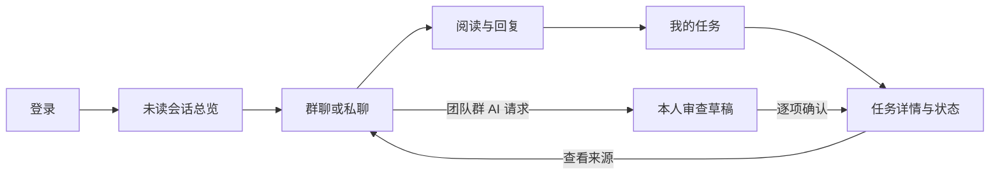

# JoeySpace 前端设计方案

更新日期：2026-10-09

状态：**整体设计已确认 v0.2；F1—F5 的 Vue 核心流程已实现，F6 已取得云端真实浏览器验收证据。** 当前页面和运行方式见[前端 README](../frontend/README.md)，逐项通过范围与模型稳定性等限制见[F6 报告](frontend-f6-review.md)。下文保留设计时的实施顺序与后置范围，“首批样例”是历史计划，不代表当前页面仍使用样例数据。

本方案面向小团队协作，围绕“先看讨论，再处理自己的任务”组织体验。前端方案独立记录在本文；后端能力、权限及实际验收以 [项目计划](project-plan.md)、现有接口和 [架构记录](architecture-decisions.md) 为依据。

用户已认可完整设计并允许推进开发，随后补充“后端为主、前端控制范围，但核心体验不能潦草”的要求。本文保留完整业务方向，实施按小步骤计划推进。涉及新增消息协议、权限、数据关系和具体后端接口的契约仍按项目约定单独审查。

## 1. 目标与已确认决定

目标用户是需要沟通、分工和处理任务的小团队成员。成功的体验是：用户登录后找到需要关注的会话，读懂讨论、回复，再进入自己的任务并更新状态；需要 AI 协助时，能从当前团队群整理任务并逐项审查结果。

| 已确认项 | 设计约束 |
| --- | --- |
| 技术栈 | TypeScript + Vue 3 + Vite |
| 使用设备 | 主要在电脑浏览器使用 |
| 使用顺序 | 聊天优先，先看团队讨论，再处理分配给自己的任务 |
| 默认入口 | 未读消息总览，不自动打开某一条会话 |
| 总览内容 | 团队主群聊和私聊一起展示，按会话合并 |
| 关注重点 | 未读和 @我的消息，保留进入其他团队讨论的入口 |
| 打开会话 | 保留左侧会话列表，聊天内容不占满整个页面 |
| 团队与群聊 | 第一版每个团队先使用一个主群聊；保留以后增加其他会话的空间 |
| 任务入口 | 左侧保留始终可见的“消息”和“我的任务”入口 |
| 审查方式 | 一次提交完整设计，用户集中审查后讨论修改 |

用户尚无前端开发经验。实施时每个小步骤都应能运行、能解释、能验证；完整方案不等于一次实现所有页面。

### 核心体验与范围取舍（用户补充，2026-10-09）

前端质量直接影响后端能力是否好用。优先做好会话信息层次、中文阅读、切换与滚动、表单反馈、加载/空状态/失败状态及键盘操作。控制开发量主要通过推迟非核心功能实现，不降低核心页面的完成质量。

看板拖拽、统计图表、复杂个人设置、多主题和完整手机体验按实际需要后置。避免引入整套管理后台模板、大量通用封装和一次铺开全部模块。组件和依赖按其对核心体验的实际帮助选择，不能单纯以数量少为理由省掉必要交互。

首批仅建立可运行的消息页面与导航，使用明确标注的样例数据。Vue Router 用于会话导航与浏览器返回；局部状态先用 Vue 本身的能力。Pinia 在真实共享状态出现后再引入，Element Plus 在真实表单/日期/面板的收益明确时按需引入，不作为首批工程启动的前提。详细任务见[首批实施计划](superpowers/plans/2026-10-09-frontend-message-foundation.md)。

## 2. 调研依据与方案比较

调研日期为 2026-10-09。以下依据来自产品官方帮助、设计文章和技术官方文档。产品适配程度、开发成本及推荐方向是结合 JoeySpace 场景作出的判断。

| 参考 | 官方设计或交互依据 | 在 JoeySpace 中借鉴什么 | 取舍 |
| --- | --- | --- | --- |
| 飞书 | [消息创建任务并返回原会话](https://www.feishu.cn/hc/zh-CN/articles/360741352378-创建任务) | 讨论 → 任务 → 返回来源讨论的连续路径 | 当前项目有团队任务和来源消息引用，但不照搬多负责人、子任务等功能 |
| Slack | [分层侧边栏](https://slack.com/help/articles/212596808-Adjust-your-sidebar-preferences)、[Activity](https://slack.com/help/articles/46751260742035-Introducing-the-new-Activity-view-in-Slack) | 固定模块导航、会话列表、集中处理需要关注的信息 | 用户已选择按会话合并，因此总览不逐条铺满消息事件 |
| Linear | [2026 年界面调整](https://linear.app/now/behind-the-latest-design-refresh)、[Inbox](https://linear.app/docs/inbox)、[列表与看板](https://linear.app/docs/board-layout) | 导航弱化、正文突出；任务列表字段清楚；详情按需展开 | 第一版优先列表，避免同时开发看板、拖拽和多套筛选 |
| Microsoft Teams | [Planner 与任务通知](https://support.microsoft.com/en-us/planner/teams/getting-started-with-planner-in-teams)、[消息创建任务](https://support.microsoft.com/en-us/teams/platform/create-a-task-from-a-teams-message) | 消息、任务、通知各有入口，任务保留沟通上下文 | 不采用复杂的多层应用工作台 |

三种整体方向已经比较过：聊天优先适合连续阅读讨论；收件箱优先适合逐条分拣事件；综合工作台适合同时查看多个模块，但首页信息更多。用户已选择聊天优先，因此推荐固定模块导航 + 会话列表 + 工作主区域。

## 3. 整体页面结构

建议使用三栏桌面结构。最左侧是模块导航，中间是当前模块的列表或筛选，右侧是工作主区域。任务详情、群资料和 AI 草稿在需要时打开临时侧面板。

    ┌────────┬────────────────────┬──────────────────────────────────────┐
    │JoeySpace│ 消息列表           │ 未读总览 / 当前会话                  │
    │        │                    │                                      │
    │ 消息 ● │ 未读总览           │ 未读会话              筛选：全部团队 │
    │ 我的任务│ 搜索会话           │                                      │
    │ 通知 ● │                    │ [@我] 工程团队 · 主群聊   5 条未读   │
    │ 团队   │ 团队主群聊         │ 最近一条消息的发送者、摘要、时间      │
    │        │  工程团队       5  │                                      │
    │        │  设计团队       2  │ 小王 · 私聊              2 条未读   │
    │        │ 私聊               │ 最近一条消息预览                     │
    │        │  小王           2  │                                      │
    │        │  小李              │ 点击任一项，在本区域打开会话          │
    │ 头像   │                    │ 左边两栏保留                         │
    └────────┴────────────────────┴──────────────────────────────────────┘

这张图表达布局与行为，示例名称、未读数均为示意，不是当前数据。

建议初始尺寸：模块栏 88px，会话栏 288px，主区域自适应；会话栏可在 260—320px 间随窗口调整。以 1440×900 作为设计基准，验证 1280×720 和 1920×1080；1024—1279px 时收紧列表和留白，详情改为浮层。小于 1024px 时改用可展开列表，保留基本可读性，手机完整体验留到后续。

模块栏显示“图标 + 中文短标签”，当前模块有明显选中状态。页面内部各自滚动，输入框留在聊天主区域底部，避免整个浏览器页面一起滚动。详情面板宽约 380px；空间不足时浮于主区域，关闭后回到原列表位置。

### 导航与页面建议

| 入口 | 默认内容 | 主要操作 |
| --- | --- | --- |
| 消息 | 未读会话总览 | 选择会话、进入讨论、发起私聊 |
| 我的任务 | 分配给我的未完成任务 | 筛选、打开详情、更新状态、新建任务 |
| 通知 | 任务状态变化等持久业务通知 | 打开关联任务、显式标记已读 |
| 团队 | 我的团队与成员 | 创建团队、成员查看、拥有者管理、加入群 |
| 个人头像 | 账号菜单 | 查看本人资料、退出登录 |

AI 助手主要从当前团队群进入，不单独占一栏常驻聊天区。建议从群顶部“AI 助手”及本人 @AI 指令消息的“查看草稿”进入。独立 AI 私聊或全局执行中心应在对应接口具备后再扩展。

## 4. 消息总览与会话列表

默认进入“消息 → 未读总览”。会话列表中一直保留“未读总览”入口，用户查看聊天后可以返回。浏览器明确打开某条会话链接时，可以进入指定会话；普通登录仍进入总览。

总览建议提供“全部未读”和“@我”两个视图。两类会话同一规则展示：头像或群图标、名称、团队标签、最近消息摘要、最近活动时间、未读数量。群聊与私聊使用不同图标，不依靠颜色单独区分。@我的会话优先，其余按最近活动排序；用户正在操作列表时，新消息先更新摘要与角标，避免行突然跳动。

每一项代表一个会话。角标“5”表示 5 条未读消息；模块栏消息角标建议表示有未读的会话数量，悬停文字说明“3 个未读会话”，避免两个数字被误解为同一种计数。

最近消息摘要最多两行，任务机器人消息使用可读摘要。摘要不渲染任意 HTML。总览中的私聊属于个人身份范围；群聊有自己的团队标签，团队筛选不隐式把所有私聊归属于某个团队。

会话列表分“团队主群聊”和“私聊”。名称搜索先限定当前已经获取的会话目录，不把它称作全量消息搜索。开始私聊建议从有权限的团队成员目录选择用户，不要求使用者手填用户 ID。

未读数读取失败时显示“暂时无法更新”及重试入口；部分数据没有加载成功时不能显示“全部处理完了”。所有可见范围均查询成功且计数为零时，显示“暂时没有未读消息”，提供继续查看会话的入口。

**接口条件：** 当前接口有单个群或对方的未读查询，尚缺持久的本人会话目录、聚合未读预览及普通成员 @提及数据。“@我”需要服务端记录被提及的真实成员身份并校验，不能以正文包含昵称当成可靠结果。@AI 的现有命令规则只用于 Agent 触发。上述条件补齐后才能把完整总览标为可用。

## 5. 团队主群聊与成员范围

已有后端明确区分团队和群，并支持一个团队下多个群。团队成员可以查看群目录，但需要自行加入群；目录可见不代表有消息读取或发言权限。

用户确认的“每个团队一个主群聊”作为首版使用方式及常用入口：新团队引导拥有者创建一个日常讨论群；已有团队由拥有者明确选定常用群。第一版导航突出这个入口，同时保留已有其他群的访问路径。不能直接把列表第一项认作主群，也不能因前端展示为主群而自动添加所有团队成员。

“主群”目前尚无正式标识接口。建议补充团队内常用群的配置及读取约定；在确认契约前只做样例展示，不以浏览器本地默认值充当团队统一设置。团队创建成功、群创建失败时分别显示结果，允许继续创建群，不误报整个团队创建失败。

未加入群时显示“加入讨论群”，成功加入后才能加载会话。离队或群访问被拒绝时清理该资源的消息、草稿和成员数据，显示当前无法访问。重新加入团队后，按照现有规则重新加入群。团队拥有者、管理员、普通成员的按钮与现有权限一致，不根据角色名称推断额外管理权限。

## 6. 会话阅读与消息发送

打开会话后，左侧两栏保留，主区域显示群名或对方名称、连接状态、历史消息及输入框。群聊使用按时间排列的消息流：头像、发送者、时间、正文。同一人相邻消息可缩减重复头像；本人消息轻度突出，长文字不强制做窄气泡。机器人带明确标识。

顶部按钮包含群资料、当前群任务入口和 AI 助手。群资料及成员列表按需展开。初期历史消息通过“加载更早消息”分页；加载前记录滚动位置，加载后尽量保持当前阅读位置。

实时新消息到来时，用户在底部才跟随滚动；正在看旧讨论时显示“有新消息”按钮。聊天切换保存同一登录会话内的输入草稿；身份、团队或会话切换必须隔离草稿和异步回包。

输入框建议 Enter 发送、Shift+Enter 换行；中文输入法正在选字时 Enter 不发送，并保留可点击的发送按钮。空白正文、断连、无权限时不能提交。以服务端限制校验长度，不自行假设消息支持图片、附件、语音或富文本。

发送状态按实际链路表达：提交中、服务端已受理、历史已确认、失败、结果待核对。现有 ACK 不代表全部成员收到或阅读；超时后先核对历史，不能换一个消息标识自动再发。重复实时帧和离线消息按 msg_id 合并，历史持久 ID 用于分页和阅读确认；两种 ID 不混用。

### 已读规则

沿用 A73/A78：加载历史、收到实时消息、进入会话和离线 ACK 都不自动标已读。建议在消息区提供“将已加载的收到消息标为已读”，明确操作范围，不提供未经后端支持的“一键把全部历史已读”。

只提交当前有效会话中已加载且符合规则的具体消息 ID，单次遵守 100 个上限；成功后刷新权威计数。确认超时可能已经写入，先重新查询，再以相同 ID 明确重试。群聊中本人普通消息不计未读，机器人消息按现有规则处理。发送者界面不展示未经接口支持的“对方已读”。

## 7. 我的任务与团队任务

“我的任务”默认展示分配给本人的未完成事项，提供“全部团队 / 指定团队”筛选。团队页面提供“团队任务”，两者使用一致的列表和详情组件，避免两套相似页面。

首版优先列表：标题、团队、负责人、状态、截止时间、来源。状态仅为“待办 / 进行中 / 完成”。没有负责人显示“未指派”，没有截止时间显示“未设置”；日期以用户可理解的本地时间显示，提交统一使用接口约定的 UTC 毫秒。

建议个人列表按已逾期、近期到期、其他未完成分组，无截止时间的任务放在最后；完成任务单独切换查看。这个排序需要基于完整的服务端筛选分页，不能只过滤当前 20 条团队任务后宣称是全部个人任务。

点击任务打开详情面板，内容包括标题、说明、负责人、截止时间、来源会话以及当前允许的操作。现有任务只支持创建、列表和状态更新，所以已创建任务的文字、负责人和时间首先只读；不展示尚无写入接口的编辑功能。创建者、负责人和团队拥有者的状态操作沿用后端核权。

新建任务表单包含团队、标题、说明、负责人及可选截止时间。从团队群消息菜单选择“创建任务”时自动带入该群与持久消息 ID；从任务入口创建时来源可以为空。现有来源校验针对团队群消息，首版不把私聊来源强行转成团队任务。

创建请求复用同一次操作的幂等键。写入超时不能显示成功或改用新键重复提交。状态变更成功后更新列表，失败保留原状态。当前没有独立任务详情查询，直接链接及长久刷新恢复需要补读接口；列表已加载的数据可以用于当前页详情。

“查看讨论来源”应定位消息并显示邻近上下文，保留返回任务的入口。当前历史是游标分页，没有按目标消息读取上下文的专用接口，需补齐后再承诺直接定位；无权限时展示来源不可访问，任务本身是否可读由任务服务决定。

## 8. 通知与消息的分工

消息总览用于读会话；通知用于处理任务状态变化等业务事件。通知条目包含团队、任务、操作者、状态变化和时间，点开关联任务，并提供显式“标记已读”。

当前持久通知是团队范围的任务状态通知，不把任务指派、所有 @消息或 Agent 结果都假定为已有通知种类。已读操作不自动表示任务完成；打开通知也不自动改变已读状态。

WebSocket 任务通知提示只表示“可能有更新”。页面收到提示后查询 Task 的权威通知，不能拿实时提示拼出正文或全量未读数。断线重连补查最新通知；去重使用 notification_id。首版可先交付明确标注的“当前团队通知”，跨团队统一入口在聚合接口具备后再完成。

消息角标与通知角标有不同含义，通知模块中只展示能够权威计算的计数或新提醒点，不用当前页条数冒充全部未读数。

## 9. AI 助手与任务草稿

AI 融入团队群使用，突出“帮助理解讨论、整理待办”的业务用途。直接问答通过现有 Ask 接口绑定当前团队与群；不把这个 HTTP 问答接口包装成已有持久化 AI 私聊历史。

推荐两个入口：群顶部“AI 助手”用于当前群问答；本人发送的“@AI 整理任务 …”消息提供处理状态及草稿入口。仅原指令发起人可读取后台状态和本人草稿，其他成员可以看到最终群内机器人回帖。

后台状态对应 queued / running / exhausted / completed，显示“等待处理 / 正在整理 / 本次未能完成 / 草稿已生成”。不提供现有协议没有的取消、进度百分比或后台重试按钮。状态读取只轮询当前打开的本人指令，离开或失去权限时停止；长时间没有结果提供手动刷新。

草稿面板逐项展示 1—5 项任务候选：标题、说明、来源、负责人、截止时间与解析依据。重名、未匹配或不明确时间要求本人选择成员、设时间或明确未指派/未设置。编辑保存与任务创建是分开的动作。

每一项提供“确认并创建任务”和符合当前状态时的“跳过”。不默认全选批量创建。确认携带已读取的内容版本和本人审查字段；冲突时重新读取并让用户核对，冻结后禁止继续编辑。各项结果独立展示，部分成功时不能把全部显示为失败。

任务已创建但机器人回帖待处理时，显示“任务已创建，群内通知待处理”；重试只重试该项回帖。IM accepted 只表示回帖已受理，不能表述为所有群成员已收到。模型超时和预算失败提供可读提示，保留已保存状态，不虚构结果。

全局运行列表、刷新后发现全部历史草稿和独立 AI 私聊需要新的发现接口；首版使用指令消息上的入口和已知 run_id 的详情链接。

## 10. 视觉与可访问性建议

推荐浅色、低干扰的协作界面：白色工作区、浅灰侧栏、蓝色主操作，少量状态色。导航、摘要和辅助字段视觉权重低于当前正文；布局用留白、细分隔线和一致对齐建立层次。这个方向结合 Linear 的导航弱化与结构减噪原则。

| 项目 | 建议初值 |
| --- | --- |
| 主色 | #2563EB；选中底色 #EFF6FF |
| 主背景 / 侧栏 | #FFFFFF / #F8FAFC |
| 正文 / 次要文字 | #1E293B / #64748B |
| 边框 | #E2E8F0，用于装饰分隔 |
| 成功 / 警告 / 错误文字 | #15803D / #B45309 / #B91C1C |
| 正文字号 | 14px；聊天正文 15px；页面标题 20px |
| 正文行高 | 1.6；长段正文宽度约 70—85 个字符 |
| 间距 / 圆角 | 4、8、12、16、24px；常规圆角 8px |

字体使用系统中文字体，避免依赖外部字体下载。图标使用同一套线性风格，不用 Emoji 替代所有功能图标。昵称头像没有图片时用文字占位，不新增头像上传接口。

建议首版先做好浅色主题；深色主题可在后续复用颜色变量扩展。空状态用简洁文字与明确操作，不放大幅装饰图片占用聊天空间。

参考 [WCAG 2.2](https://www.w3.org/WAI/standards-guidelines/wcag/new-in-22/)：按钮、菜单、面板支持键盘操作，焦点可见且不被遮挡，颜色之外同时用文字说明状态。普通正文按至少 4.5:1 对比度检查，图标按钮有可读名称；悬停操作也能通过键盘焦点出现。弹层关闭后焦点回到原按钮。实时消息不连续抢焦点或让辅助阅读工具逐条重复朗读。

这些是设计目标，颜色及最终尺寸需在可运行页面中核验。

## 11. 加载、错误与权限体验

| 情况 | 页面行为 |
| --- | --- |
| 首次加载 | 列表骨架或局部加载，保留导航 |
| 刷新失败 | 保留仍有权访问的旧数据，标明更新失败并允许重试 |
| 实时连接断开 | 顶部轻提示“连接已断开，正在重连”；保留输入，不显示发送成功 |
| 登录失效 / 401 | 关闭旧连接、清除旧身份数据，返回登录 |
| 资源无权限 / 403 | 清除该资源私有数据，说明无法访问；不把所有 403 都当成退出登录 |
| 写入超时 | 显示“结果待核对”，按具体业务查询或同键重试，不立即重复创建 |
| AI 长等待 | 普通聊天仍可用，AI 面板显示真实状态 |
| 数据为空 | 区分没有会话、没有未读、没有任务与获取失败 |

各列表保留分页，不一次请求全部历史。页面切换取消或忽略旧请求；身份与资源范围匹配后才能采用响应。所有会话和任务 ID 保留为十进制字符串，避免 JavaScript 大整数精度丢失。

## 12. 前端技术组织建议

核心栈与整体方案已确认。依赖按当前任务需要逐批引入并固定版本，下表描述整体方向，不要求首批全部安装。

| 项目 | 推荐 | 备选与理由 |
| --- | --- | --- |
| 页面组件 | Vue 单文件组件 + Composition API + script setup + TypeScript | 使用一种统一写法，便于按页面理解 |
| 页面导航 | Vue Router | 官方路由，支持会话和任务链接、浏览器返回；手写导航会重复实现历史与参数管理 |
| 跨组件状态 | 首批使用 Vue 局部状态；出现真实跨页面共享需求后考虑 Pinia | 共享本人身份、会话与连接状态；局部表单仍放组件内，避免一个巨型 store |
| 基础组件 | 首批使用原生控件与 CSS；真实表单、日期和复杂面板按需采用 Element Plus | Naive UI 也是可行方案；必要组件以交互质量和维护成本决定，不自制庞大控件体系 |
| 布局样式 | CSS Grid / Flex + CSS 变量 | 聊天列表和消息流由项目组件定义；此阶段无需同时引入额外 CSS 框架 |
| HTTP | 浏览器 fetch 的薄封装 | Axios 可行，但当前接口需求用原生能力即可处理 |
| 实时 | 原生 WebSocket + 独立连接管理模块 | 复用已有协议，集中处理心跳、重连、身份切换和去重 |
| 工程检查 | vue-tsc + Vite build，必要的交互测试 | Vite 编译本身不执行完整类型检查 |

[Vue 官方 TypeScript 指南](https://vuejs.org/guide/typescript/overview.html)提供 Vite / TypeScript 项目创建及 vue-tsc 的说明；[Vue Router](https://router.vuejs.org/introduction.html)和 [Pinia](https://pinia.vuejs.org/introduction.html)分别提供官方导航与跨组件状态能力。[Element Plus 组件目录](https://element-plus.org/en-US/component/overview.html)覆盖本方案所需的基础控件；[Naive UI 官方仓库](https://github.com/tusen-ai/naive-ui)说明其 TypeScript 和主题定制能力。推荐 Element Plus 是针对本项目表单、日期和中文资料的实施便利性判断，不表示必须用它的表格构成聊天界面。

建议新增独立 frontend 目录，使用一个 Vue 单页应用。按实际实施逐步建立：

    frontend/
      src/
        layouts/        模块导航和整体框架
        pages/          登录、消息、任务、通知、团队
        components/     会话行、消息、任务详情、草稿项
        api/            HTTP 请求与接口类型适配
        stores/         登录身份、会话、实时连接共享状态
        composables/    有明确复用需求的页面行为
        styles/         颜色、尺寸、全局基础样式

不要预建大量空目录。推荐页面地址包括 /messages、/messages/direct/:peerId、/messages/teams/:teamId/groups/:groupId、/tasks、/teams/:teamId/tasks/:taskId、/notifications 和团队页面。页面导航与网络接口路径分开，深链接加载仍须后端核权。

开发时 Vite 把 HTTP 与 WebSocket 转发至当前 Gateway / WS。生产建议由已有部署入口提供静态资源并分别转发 HTTP 与 WS，使用同域 HTTPS/WSS；新增部署接线另行审查。浏览器只访问 HTTP/WS，不直连 gRPC、数据库或 Kafka，VITE 配置中不放服务端密钥。

登录继续使用既有 Bearer Token。候选方案是内存状态 + sessionStorage 保存本浏览器标签页登录，退出时清理全部身份范围缓存；代价是脚本可访问 Token，需避免任意 HTML 渲染。另一方案 HttpOnly Cookie 需要后端认证及 WebSocket 握手配套调整。此项待审查，不在本轮改变认证方式。

## 13. 现有能力与实现前置

核对依据：[Gateway 路由](../api/main.go)、[User 协议](../rpc/user/user.proto)、[IM 协议](../rpc/im/im.proto)、[Task 协议](../rpc/task/task.proto)、[Agent 协议](../rpc/agent/agent.proto)及原生演示页。当前云端核心业务曾完整通过，但模型稳定性仍有观察项；Vue 的 F1 样例界面已完成本地检查，真实后端接线和统一验收仍未进行。

| 页面需求 | 已有接口能力 | 差距及建议 |
| --- | --- | --- |
| 登录、注册、本人信息 | /api/v1/user/login、register、info | 可直接适配，统一处理 code/msg/data 与 HTTP 错误 |
| 我的团队 | 创建团队、成员目录、角色及退出 | 缺本人团队目录；由 User 提供只读目录，页面不要求输入团队 ID |
| 会话列表与未读总览 | 群目录、单个群/单聊历史与未读 | 缺本人可访问会话目录、成员展示信息、最新预览、聚合计数及 joined 状态；由 IM/User 分别保持数据归属 |
| 主群入口 | 团队内多群、创建与加入 | 缺正式主群设置；不能通过隐式默认或自动加入改变已有模型 |
| @我 | 明确 @AI 指令触发 | 缺普通成员提及的结构化存储及本人查询，先确认消息协议扩展 |
| 来源消息定位 | 游标分页群历史、来源权限检查 | 缺目标消息上下文读取；提议 IM 提供有权限的定位查询 |
| 我的任务 | 团队任务分页与三态修改 | 缺跨团队本人任务查询、按负责人/状态/截止时间分页及独立详情；由 Task 提供 |
| 通知 | 本人当前团队状态通知、逐条已读、实时更新提示 | 缺跨团队聚合与全量未读统计；现有提醒不承载完整详情 |
| Agent | 当前群问答、本人指令状态、草稿逐项编辑确认跳过及回帖重试 | 可从消息接入；缺全局执行目录、持久 AI 私聊历史 |
| 发送与恢复 | WS、历史、离线读取/ACK、msg_id | Vue 客户端需遵守现有心跳、ACK、身份及去重语义 |

推荐先补少量正式导航必需的只读查询，再接完整页面。主群配置与普通成员提及另涉及配置写入、消息协议及可能的存储变化，须单独审查，不能作为只读查询顺带实现。Gateway 可组合各服务返回的读模型，但不直接读各服务数据库；User、IM、Task 的归属与权限不改变。前端逐个请求已知群的计数可作有界联调切片，不能替代持久会话目录和正确分页的正式总览。

这些缺口需要后续独立定义契约、说明代价并审查；本稿没有提前定死 RPC 字段、HTTP 路径或数据库迁移。

## 14. 核心操作链

1. 登录 → 获取本人身份与会话目录 → 显示未读总览。
2. 选择群或私聊 → 校验范围并加载历史 → 阅读、回复 → 本人显式确认已加载的收到消息。
3. 点击“我的任务” → 查询分配给本人的任务 → 打开详情 → 修改状态。
4. 从任务查看来源 → 有权读取原群消息 → 返回任务继续处理。
5. 在团队群请求 AI 整理 → 本人查看草稿 → 保存调整 → 逐项确认创建 → 查看任务与群回帖状态。

普通业务查询：浏览器 → HTTP Gateway → 相应 gRPC 服务 → 该服务的数据。实时聊天复用浏览器 ↔ WS → Kafka → Push 的现有消息链，持久历史与未读以 IM 查询为准。Task 的实时提示触发 HTTP 补查；Agent 的确认结果以持久状态为准。

## 15. 分阶段实施建议

本节是路线建议，具体文件与命令将在用户审查本文后写入实施计划。每阶段继续拆成独立小步骤，每批最多九步；后端补接口与前端页面各有可审查范围，协议、依赖、迁移和共同文档由主 agent 统一负责。

| 阶段 | 单一阶段目标 | 可运行交付与验证 |
| --- | --- | --- |
| F0：方案审查 | 确定本文与关键选型 | 用户已认可整体方案，补充核心体验优先与非核心范围控制要求 |
| F1：页面骨架 | 看清聊天优先的界面 | 隔离分支已完成 Vue 工程、导航、未读总览与会话静态样例；数据明确标为样例，三种桌面尺寸与键盘导航已检查；待用户审查 |
| F2：真实导航 | 登录后不用输入 ID 找到会话 | 登录、本人团队与会话发现的最小只读链路；核对两账号的可见范围 |
| F3：真实聊天 | 完成消息阅读、发送和恢复 | 单聊/群聊、历史分页、未读、显式确认、断线补拉与去重；处理 @我 所需契约 |
| F4：任务与通知 | 看完讨论后完成个人工作 | 本人任务查询、创建、三态更新、来源定位、持久通知；权限及不确定结果验证 |
| F5：AI 草稿 | 从讨论生成经本人审查的任务 | 问答、指令状态、逐项编辑确认跳过、回帖重试及失败提示 |
| F6：统一验收 | 确认可交付的正式体验 | 双账号完整流程、浏览器视觉检查、部署静态页/API/WS 路由核对 |

前端单元和组件测试聚焦真实风险：切换身份后的旧回包、会话去重、正确阅读 ID、输入法 Enter、分页筛选完整性、草稿版本冲突和重复提交。每次运行类型检查、构建及与改动相关的检查；完整真实环境验收在最终阶段集中进行。

暂缓看板拖拽、全文搜索、消息编辑撤回、线程回复、附件上传、音视频、复杂审批、日历、全局 Agent 执行中心及全量手机体验。这些不作为聊天 → 任务 → AI 草稿链路的前提。

## 16. 审查与验收标准

设计审查重点是：整体布局是否符合聊天优先；未读与显式确认是否容易理解；任务和 AI 面板是否容易找到；浅色简洁风格是否合适；新增技术库与少量后端查询是否接受。第 1 节已确认决定保持，其他建议均可在集中审查中修改。

后续实现验收应满足：

- 登录默认显示按会话合并的未读总览，团队群与私聊同时可见；普通 @提及有服务端依据。
- 打开任一会话后模块栏和会话列表保留；切换会话不混入上一会话的消息或输入。
- 历史、实时接收与离线 ACK 不自动标已读；本人只确认实际加载且允许确认的消息。
- 加载失败不显示零未读或“全部完成”；断线和异步受理不冒充送达或阅读成功。
- “我的任务”覆盖正确的本人范围，分页筛选无漏项；三态、来源与权限一致。
- 通知跳转和显式已读正确，实时提示不冒充权威正文或计数。
- AI 草稿由发起人逐项审查，重复确认不重复建任务；回帖失败可以单独处理。
- 离队、无权限、过期登录和版本冲突都有对应反馈，私有数据及时清理。
- 1280×720 等桌面尺寸可操作；键盘能进入列表、输入、表单和关闭面板。
- 文档区分样例展示、真实接口联调、部署验证及仍未验证的能力。

## 17. 当前记录与后续动作

2026-10-09：用户要求一次提交完整方案供集中审查。本稿基于之前所有明确选择，补充官方产品调研、现有接口核对、页面规格、状态与权限体验、技术候选和实施路线。最初交付时只包含设计文档及架构关联；后续 F1 实施状态见下段。

用户已认可整体方案并允许推进开发；追加范围约束已记录在第 1 节。2026-10-09 的 F1 交付位于独立 `codex/frontend-message-foundation` 分支，Vue 工程、样例总览/会话、任务入口说明已实现，模型测试、类型检查、构建和本机 Chrome 三种桌面尺寸检查通过，待用户审查。当前没有真实后端数据或发送/已读操作。后续新增消息协议、权限或服务边界仍按项目约定审查。
