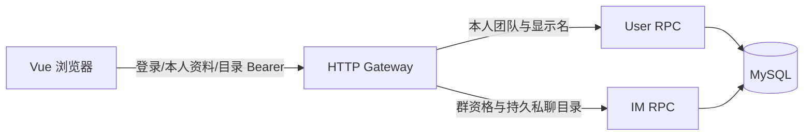

# JoeySpace 前端 F2：真实登录与会话导航设计

日期：2026-10-09
状态：**供用户审查关键选型；受影响的协议、数据表和产品实现待审查后推进。**
上位方案：[前端设计](frontend-design.md)；后端阶段与权限以[项目计划](project-plan.md)和[架构记录](architecture-decisions.md)为准。

## 1. 目标与可验证结果

F2 让成员在电脑浏览器登录后，**不用手填团队、群或对方的 ID**，找到自己所属团队、可加入的群、已经加入的讨论群和有持久聊天记录的私聊对象。选择会话后，浏览器地址对应真实资源；刷新和直接打开链接重新核权。退出登录、Token 过期、离队与未入群都有正确反馈。

F2 是导航接线。真实消息历史分页、WebSocket 收发、未读数、本人显式已读、普通成员 @提及和任务操作属于后续阶段。登录后的页面不继续显示 F1 的固定样例、假未读数或假 @我；在未读能力可用前，总览明确说明其状态，并提供真实会话入口。F1 的样例数据可留作测试数据，不作为已登录用户的业务数据。

这一范围承接用户确认的“先看讨论，再处理自己的任务”：先解决知道讨论在哪里的问题，再接完整阅读与回复。前端保持三栏结构、键盘操作、空/加载/失败状态和清晰中文；控制范围靠推迟未读聚合等后续能力。

## 2. 已核对的现状

| 能力 | 当前接口与事实 | F2 缺口 |
| --- | --- | --- |
| 登录 | `POST /api/v1/user/login` 接收用户名/密码，返回 `{code:0,msg,data:{token}}`；User 签发 24 小时 Bearer JWT | Vue 登录页、身份保存、失效处理 |
| 本人资料 | `GET /api/v1/user/info` 返回十进制字符串 `id`、用户名、昵称 | 会话身份展示和刷新时复核 |
| 团队 | User 有创建团队和已知团队成员查询；无“我的团队”列表 | 本人活动团队分页查询 |
| 群 | 已知团队的群目录列出**所有**群，成员可自行加入；消息阅读另要求当前群成员资格与团队资格 | 列表中显示可靠的已加入状态，以及直接链接按资源核权 |
| 私聊 | 已知对方 ID 可查历史/未读；发送单聊不要求双方当前同队 | 从持久消息发现对方，读取其显示名；不能仅靠团队成员目录 |
| 主群和 @我 | 无正式主群标记，也无普通成员提及的服务端结构 | 本批不猜测主群、不伪造 @我 |

上述结论来自现有 [Gateway 路由](../api/main.go)、[登录处理器](../api/login.go)、[User 协议](../rpc/user/user.proto)、[IM 协议](../rpc/im/im.proto)、[群目录](../rpc/im/team_group_list.go)及[群访问校验](../rpc/im/team_group_access.go)。目录发现与消息读取是两个权限动作；页面不得将“看得到群名”当成“已入群”。

## 3. 方案取舍与推荐

### 3.1 登录状态

**推荐 A：**沿用 Bearer Token。Vue 运行时把 Token 放在内存，并用 `sessionStorage` 保存本标签页的登录状态；页面刷新后先调用本人资料接口复核。退出登录清除 Token、个人目录、未完成请求及未来的消息缓存。401 清理身份并返回登录，资源级 403 仅清理该资源并解释无权限。用户名和密码不存储。

备选 B 是仅内存保存，关闭与刷新就要重登，桌面日常使用成本较高。备选 C 是 HttpOnly Cookie，需要改后端认证与未来 WebSocket 握手，扩大本阶段服务边界。A 复用现有登录链路，代价是 Token 可被同源脚本读取；页面只用 Vue 文本渲染消息，不插入任意 HTML，日志和 URL 不带 Token。现有 JWT 没有刷新/撤销接口，F2 不虚构“续期成功”。

### 3.2 会话目录

**推荐 A：**数据仍由 User 与 IM 各自拥有，Gateway 仅按现有 Bearer 身份转发、组合少量显示字段。User 提供本人团队与有限公开显示名；IM 提供群的已加入状态和本人持久私聊目录。使用分开的、带游标的 HTTP 查询。这样前端可以按团队展开群，私聊独立分页，不需要在 F2 实现跨类型全局时间排序。

备选 B 是一次返回跨团队、群和私聊的聚合目录；它会引入跨服务查询、混合分页和更多失败组合，适合在 F3 真正做聚合未读时评估。备选 C 是浏览器遍历已知团队群、猜私聊对象或读离线投递表；它会漏项，也不能代表权威会话目录，不采用。

私聊目录先从 IM **已持久化的消息**查询，不从 `offline_messages` 推断。先验证现有索引上的查询计划和分页正确性；如需新索引，迁移由主 agent 单独提出并审查。备选的持久会话投影表可在实际规模与查询代价证明需要时再讨论；F2 不先引入新的消息写入状态。

### 3.3 主群、未读与联系人名称

群目录标为“团队群聊”，已加入者可以打开，未加入者提供本人**显式**“加入讨论群”操作；加入成功后重新查询状态。F2 不将列表第一项当主群，不自动入群，不改变已有群权限。主群配置需要拥有者写入约定，另作审查。

User 新增供 Gateway 组合目录使用的内部 RPC，批量提供已有私聊对象的昵称/用户名显示值；Gateway 只对 IM 已核实的本人会话对象调用，不新增任意 ID 的公开 HTTP 查询。此读取最多 100 个 ID，不含邮箱、电话、角色或其他私有字段。已删除/不可用对象显示中性名称，历史会话仍可定位。内部 RPC 的调用方限制沿用现有服务间连接机制，不声称新增服务身份隔离；该资料读取范围属于本方案需要用户确认的边界。

未读计数、预览及 @我暂不从客户端推断。F2 的总览和列表显示真实目录以及“未读信息将在聊天接线后显示”，不展示假的“0 条未读”“全部处理完了”或假的 @我筛选。F3 再定义权威未读与预览聚合契约。

## 4. 推荐的最小读契约

具体实施步骤见[实施计划](superpowers/plans/2026-10-09-frontend-f2-navigation.md)；用户审查后由主 agent 固定协议及生成代码。HTTP 沿用现有 `code/msg/data`、错误映射和十进制字符串 ID 风格。

1. **User `ListMyTeams` → `GET /api/v1/teams`。**从已认证本人查询 `membership_state=active` 的团队，按 `team_id` 递增键集分页，默认 20、最多 100；返回 `teams[{team_id:string,name,role}]` 与 `next_after_team_id:string`。不接受客户端指定 `user_id`。当前离队中的成员不作为可进入团队展示；无数据库迁移前提。
2. **IM 群目录补 `joined`，并提供单群读取。**现有 `GET /api/v1/teams/:team_id/groups` 保持“团队可发现全部群”，增加 `joined:boolean`，由当前群成员记录、团队活动资格及代际/关闭保护计算。新增 `GET /api/v1/teams/:team_id/groups/:group_id` 按当前团队资格返回群名和 `joined`；直接链接不需扫描所有分页。已加入群才能进入消息区；未加入群只能进入明确的加入操作。`POST .../join` 复用已有接口，不自动调用。
3. **IM `ListMyDirectConversations` / `GetMyDirectConversation` → `GET /api/v1/me/direct-conversations` 及 `.../:peer_id`。**本人从双向持久单聊消息取得不同对方及最新持久消息 ID；按最新 ID 降序分页。第一页固定 `snapshot_upper_message_id`，后续携带该上界和 `before_last_message_id`，避免新消息插入时旧页重复或漏项。单条读取用于深链接，可区分不存在、无权和查询失败。所有 ID 为字符串，不能用 JavaScript Number 转换。
4. **User 内部显示名读取。**Gateway 只将 IM 本次确认属于本人会话的 `peer_id`（最多 100 个）交给 User RPC，返回安全的 `display_name`，再加入私聊 HTTP 响应。User 不因未知或已停用资料泄露身份状态，使用中性名称。无公开任意用户查询路由。

这些读取不修改 `team_members`、`group_members`、`messages` 或本人已读记录。群入队仍由既有显式写接口完成。若真实数据量下直接目录 SQL 需要新索引，先用隔离数据库 `EXPLAIN` 证明，再单独记录迁移号与回滚/旧库兼容范围。

## 5. 页面状态与调用链

- `/login` 提供登录及现有注册接口对应的简洁入口；提交中禁用重复提交，错误解释区分账号错误、服务不可用和超时。成功后取本人资料，进入 `/messages`。刷新时先复核 Token 再装载私有目录。
- `/messages` 保留 F1 的模块栏、会话栏和主区域，默认显示**真实会话导航总览**；团队与私聊分开分页，搜索只作用于当前已加载目录，并说明范围。群名、入群状态、私聊显示名来自接口；未读/@我功能未就绪时不输出样例状态。
- 选择群/私聊或打开深链接时，按单条接口复核该资源；离队、未入群、陌生私聊、404/403 有不同反馈。F2 的讨论内容区显示“会话已找到，消息阅读将在下一步接入”，不把 F1 样例正文当真实历史。浏览器返回和左侧列表保持。
- 401 清除身份并去登录；403 清理对应资源；网络故障保留仍有权访问的已有目录但标注无法更新、提供重试。账号切换/退出时中止或忽略旧请求，并清空旧账号内容。服务未返回成功时不能显示“没有会话”。
- 后端仍校验每次请求，前端隐藏入口不构成授权。Vite 本地开发只代理 `/api` 到现有 Gateway；Token 不出现在 URL 或构建环境变量中。云端静态资源部署留最终统一验收。

## 6. 验收边界

使用两个隔离测试账号检查：成员只看到自己的活动团队；团队目录能看到可加入群但不能误读其消息；本人加入后状态更新；离队后链接失效；两账号各自看到正确的持久私聊对方；大于 `2^53` 的 ID 从 HTTP 到路由不变。覆盖空目录、分页、401、403、503/504、重复快速切换、刷新恢复与退出清理。Gateway/RPC 定向测试验证字符串 ID、Bearer 透传与错误映射；浏览器验证登录、深链接及键盘操作。真实生产数据、云端同步、完整消息读写和未读聚合不在本批验收结论内。

## 7. 用户已确认的选择

用户审查本方案后回复“没啥问题，继续”，确认：**A** 沿用 Bearer 且本标签页 `sessionStorage` 保存登录；**B** 采用 User/IM 分属的只读目录契约，私聊对象只做内部有限显示名读取；**C** F2 先交付真实导航与明确的未读待接入状态，主群配置和完整未读/@我留后续独立契约。实施契约见[接口文档](frontend-f2-api-contract.md)，本地验证结果见[项目计划](project-plan.md)。
