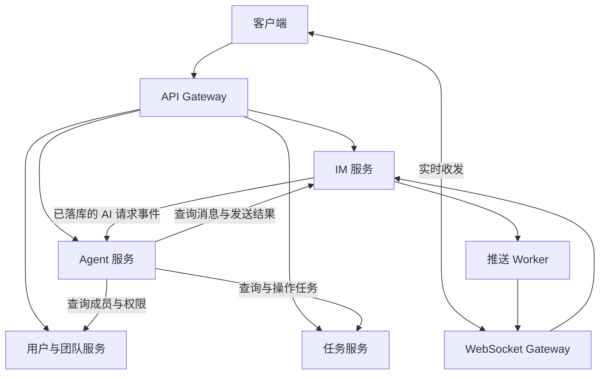

# 简化版飞书：微服务与 Agent 学习项目方案

更新日期：2026-10-03
状态：阶段 1—4 的主要业务代码按小步推进中，阶段 5 已接入 Eino 只读工具、独立 Agent RPC、Gateway 显式问答入口和演示页操作；阶段 6 已有单项草稿生成、读取、标题/说明编辑，以及接入 Agent 进程的同步确认 RPC。草稿版本已贯通 Agent、Gateway 和页面文字编辑/确认；确认先比较本人读取的版本、冻结内容和请求键，再调用 Task 并保存任务 ID，本地替身测试通过；Gateway/页面确认和任务结果展示已接入；Agent 已接入独立 mTLS 回帖客户端、持久意图及同步尝试/本人显式重试 RPC，Gateway/页面已接入独立回帖状态与本人先重读后显式重试操作。现有能力仅完成相应本地自动化验证，真实 MySQL、模型、浏览器、容器和云端联调待最终统一验收。  
用途：后续需求、架构、开发与验收的共同依据。

## 1. 项目目标与学习背景

在现有 go-im 项目上，逐步实现一个简化版飞书：具备团队成员管理、即时沟通、任务协作和 AI 助手能力。

用户已有简单 Web CRUD 开发经验，第一次系统接触微服务。项目有两个明确的学习目标：

1. 通过真实业务掌握 Go 微服务的拆分、调用、数据边界、部署和问题排查。
2. 通过团队协作场景掌握 Agent 的上下文、工具调用、多步执行和失败处理。

开发应循序渐进：从熟悉的接口和数据库操作出发，每次引入少量新概念，每个阶段都有可运行、可验证的成果。产品体验以飞书为参考，范围聚焦小团队的日常沟通和任务协作。

## 2. 已确定的技术方向

| 技术 | 本项目中的用途 |
| --- | --- |
| Go | 后端主要开发语言 |
| go-zero | 新增 API 与 RPC 服务的组织、开发和基础治理 |
| gRPC / Protobuf | 定义服务契约，实现服务间同步调用 |
| Eino | 构建 Agent，组织模型调用与业务工具执行 |
| MySQL | 用户、团队、消息、任务与 Agent 执行记录的持久化 |
| Redis | 复用现有在线状态、缓存等能力，按阶段调整 |
| Kafka | 复用消息链路，逐步承载异步业务事件 |
| WebSocket | 实时聊天、通知和执行状态推送 |
| Docker Compose | 本地环境与多进程部署验证 |

保留单仓库，渐进迁移现有 Gin API。现有 WebSocket 和 Push 代码经梳理后复用。现有 GORM 数据访问可继续使用，不把更换 ORM 作为重构前提。

具体依赖版本在实施阶段核实并固定。阶段 5 已选择火山方舟／豆包作为模型方向，但接入点 ID 与调用预算尚未确定；当前先以本地替身验证同步问答 RPC，不发送真实模型请求。模型调用通过适配层封装，密钥使用环境变量或不入库的本地配置。前端框架仍沿用阶段 4 的原生页面选择。见[架构选型记录](architecture-decisions.md) A27、A30、A31。

## 3. 产品范围

### 3.1 第一版主要界面

| 界面 | 功能 |
| --- | --- |
| 团队与成员 | 创建团队、加入或邀请成员、成员列表、基础角色 |
| 消息 | 会话列表、单聊、群聊、历史消息、机器人消息、任务卡片 |
| 任务 | 我的任务、团队任务、负责人、截止时间、状态变更 |

AI 助手融入聊天：支持私聊 AI，以及在群里显式 `@AI`。第一条完整业务链优先在群聊中实现。

### 3.2 核心演示场景

1. 三名成员在团队群里讨论一个问题。
2. 用户请求 AI 总结讨论并提取待办。
3. Agent 查询用户有权访问的消息，识别任务、负责人和时间信息。
4. 展示任务草稿，用户确认或调整后创建任务。
5. 群里展示任务卡片，可以查看关联的原始消息。
6. 成员更新任务状态，完成结果通知回原群。

示例：李四说“明天下午修复 Redis 缓存 Bug”，王五说“修完后跑一下压测”。应生成两个待办；压测截止时间未明确，不能编造。先后关系可先记录在任务说明中，完整的任务依赖调度不属于第一版必需功能。

### 3.3 暂缓范围

在线协同文档、音视频会议、复杂审批、完整日历、企业级组织架构、插件市场、多 Agent 协作、知识库 RAG、Kubernetes、服务网格和分库分表均不作为第一版前提。后续按实际学习与业务需要扩展。

## 4. 现有基础与目标架构

### 4.1 当前基础

当前仓库已有 API、WebSocket、Push 三个进程，包含用户、好友、群组、消息等模块，以及 MySQL、Redis、Kafka、Docker Compose 配置。

目前主要按接入与消息处理职责拆分进程。后续要逐步明确业务服务的数据归属、调用契约与失败处理。现有功能是否稳定应通过实际验证确认，不能仅凭代码或 README 宣称已验收。

### 4.2 目标服务边界

| 服务或组件 | 职责与数据归属 |
| --- | --- |
| API Gateway | HTTP 接入、认证、参数处理、调用聚合；不直接操作各业务服务的数据库 |
| 用户与团队服务 | 用户身份、团队、团队成员、团队角色；从用户 RPC 开始，第二阶段扩展团队能力 |
| IM 服务 | 会话、群、群成员、消息、消息历史与消息访问权限 |
| 任务服务 | 任务、负责人、状态、操作记录、来源消息引用 |
| Agent 服务 | 模型与工具编排、执行状态、待确认草稿、工具调用记录 |
| WebSocket Gateway | 连接、心跳、实时收发；业务校验归相应业务服务 |
| 推送 Worker | IM 内部的异步消息投递组件，可独立部署 |

以上是目标边界，不要求在第一阶段同时创建所有服务。一个业务服务可以包含 API、RPC 或 Worker 等多个进程。



图中表达逻辑调用关系；Kafka Topic、RPC 方法、部署端口及目录结构在对应阶段详细设计。

### 4.3 数据与调用原则

- 团队和群是不同实体：团队是成员和权限范围，一个团队可有多个群。
- 任务归属于团队，可关联会话及来源消息。群成员资格和团队成员资格分别校验。
- 每个服务拥有自己的数据模型和迁移脚本。跨服务通过 RPC 或事件协作，不共享业务 Repository，不跨库直接读写。
- 开发期可共用 MySQL 实例，目标上按业务服务分逻辑库并限制账号权限；用户与团队暂属同一服务。
- 同步查询和需要立即返回结果的命令优先使用 RPC；通知和耗时处理按需要异步化。
- 业务服务校验资源权限，不能仅依赖网关验证 JWT。内部调用携带可信的操作人和团队上下文。
- 最初使用简单、明确的服务地址配置；服务发现等能力随阶段推进再引入。

## 5. 分阶段路线与验收

| 阶段 | 功能交付 | 学习重点 | 最小验收 |
| --- | --- | --- | --- |
| 1. 第一次服务调用 | go-zero API、用户 RPC；注册、登录、个人信息 | API 与 RPC 的分工、Protobuf、配置、超时和错误映射 | 经 API 调用 RPC 完成注册登录及本人信息查询；错误凭证、无效 Token、RPC 不可用能正确返回错误 |
| 2. 团队协作基础 | 创建团队、加入或邀请成员、成员列表、基础角色 | 身份与权限、服务内事务、资源归属 | 两名用户加入同一团队；非成员不能访问团队私有信息，普通成员不能越权管理 |
| 3. 接入现有 IM | 团队群聊、历史消息、实时推送、简单聊天页面；保留单聊 | 长连接、消息生命周期、Kafka 消费、业务与连接的分工 | 两个客户端能收发和查询消息；非群成员访问被拒绝；重连及基本失败场景有验证 |
| 4. 任务服务 | 人工创建、指派、查询、更新任务，基础任务页面与卡片 | 独立数据边界、RPC 协作、业务状态流转 | 团队成员完成任务全流程；跨团队访问被拒绝；任务能关联来源会话 |
| 5. 第一个 Agent | Eino 对话、查询当前会话消息、查询任务；提供私聊或群内入口 | 上下文、Tool Calling、工具参数、执行结果 | Agent 使用真实工具结果回答；无权限、模型超时和工具失败时不虚构成功 |
| 6. Agent 完成协作 | 总结、提取待办、确认后创建任务、回传任务卡片 | 多步执行、状态持久化、幂等、恢复 | 从群聊创建有来源的任务；重复确认或重试不重复创建；重名或模糊时间能处理 |
| 7. 完善整体体验 | 任务变更通知、未读消息、执行记录、部署与排查 | 事件可靠性、日志、追踪、故障恢复 | 核心演示全程跑通；部署步骤可复现；关键失败可定位并按设计重试 |

每阶段都应拆成小步骤，先跑通最小功能，再补齐对应错误场景。基础鉴权、数据校验、超时和必要幂等随功能实现，不能全部推迟到第七阶段。

### 第一阶段建议顺序

1. 说明目录布局、进程分工和一次请求经过的节点。
2. 建立最小用户 RPC 与 API 调用，先跑通“查询个人信息”的技术链路。
3. 接入用户数据库，补齐注册、登录、身份校验，形成可用功能。
4. 验证 RPC 停止、请求超时、凭证错误等场景。
5. 记录启动方式、请求示例和调用链解释。

```text
客户端 → go-zero API → gRPC 用户服务 → MySQL
```

## 6. Agent 的第一版设计要求

### 6.1 工具范围

以下工具名为设计草案，实施时可按接口契约调整：

| 工具 | 业务用途 |
| --- | --- |
| get_conversation_messages | 读取有权限的当前会话消息，限制数量和时间范围 |
| resolve_team_member | 将名字匹配到真实团队成员，遇到重名返回候选 |
| list_tasks | 按团队、负责人、状态等条件查询任务 |
| prepare_task_drafts | 形成结构化、可编辑的任务草稿 |
| create_tasks | 创建已授权且经过后端校验的任务 |

Agent 通过工具适配层调用业务服务，不直接连接业务数据库。操作人身份和团队权限由后端确定，模型输出不构成授权。聊天内容作为待分析数据，不能改变工具权限。

### 6.2 上下文与交互

- 使用显式 `@AI` 或用户操作触发，避免每条普通消息都调用模型，也避免机器人回复循环触发。
- 首先限定当前会话和明确消息范围，逐步扩展检索能力。
- 第一版对任务写入采用“草稿 → 用户确认或修改 → 创建”的流程。确认后执行前再次校验权限与参数。
- 相对时间结合原消息时间和团队时区解释；时间不明确、成员重名时澄清或保留未指定字段。
- 展示来源消息引用；只根据工具实际返回结果报告创建成功。
- 普通聊天与模型执行解耦，长时间执行通过任务状态和异步结果反馈。

### 6.3 状态与可靠性

建议状态：`queued`、`running`、`waiting_confirmation`、`succeeded`、`failed`、`cancelled`。保存运行 ID、触发人、团队、来源消息、草稿、执行结果及必要的工具调用记录。

创建任务的幂等键由后端根据本次操作和草稿项稳定生成，由任务服务持久化校验。任务创建成功但聊天回复失败时，应重试结果投递，不能重新创建任务。多项创建发生部分成功时，记录每项结果，重试只处理尚未成功的项。

模型调用和工具执行需要超时、有限重试、最大执行步数及用量记录。先实现单 Agent 与少量工具，后续再根据场景增加能力。

## 7. 现有代码迁移与基础问题

采用逐模块迁移，保留可运行的旧链路，明确新旧服务切换点。同一份业务数据避免长期由新旧两套逻辑独立写入。迁移或删除现有数据前，明确备份与回退方法。

进入相应模块时应检查并处理：

- 群聊历史读取和消息发送的成员权限。
- WS 注册地址在跨容器、多实例环境中的可达性。
- 消息去重、Kafka 投递、消费处理和 ACK 的对应语义；验证失败重试不会假报成功或丢失处理。
- 离线消息确认、重连补拉、重复消费以及在线状态更新的正确性。

这些是待验证事项，不代表已完成修复或已有可靠性保证。每次只处理与当前阶段相关的问题，必要的前置修复可提前完成。

## 8. 后续协作与开发约定

**重要要求：用户需要逐步审查重构。用户已允许每轮工作量增大到原来的约三倍，最多连续九个独立小步骤后集中汇报，无须凑满九步；每个步骤仍须分别解释清楚，不能只交付代码或等整个阶段结束后再统一说明。**

- **控制每步范围**：每步只解决一个明确问题，尽量减少改动文件和代码量；不夹带无关格式化、重命名、抽象整理或后续阶段功能。若一步涉及较多改动，应先拆成更小、可独立理解和验证的步骤；确实无法拆分时，说明必要性和涉及范围。
- **动手前说明**：本轮每个小步骤要做什么、为什么要做、解决现有的什么具体问题、预计修改哪些文件及各自作用。
- **完成后便于审查**：最多九个独立小步骤后集中汇报，逐项列出全部实际修改的文件并提供定位，解释关键代码和请求调用链的变化，给出验证命令、实际结果及未验证部分。
- **逐步沟通**：允许一轮连续完成至多九个小步骤再集中汇报，但每一步仍只有一个目标；用户随时可提前审查，不能为凑九步扩大范围。
- **关键选型先讨论并记录**：新增或替换语言、框架、中间件，改变服务边界、数据归属、权限模型、跨服务通信方式等会影响整体架构的决定，立即暂停受影响的实现，列出问题、候选方案、优缺点、推荐理由和迁移影响，与用户讨论确定后再编码。将当前选择、备选方案、理由、代价和确认状态写入 [架构选型记录](architecture-decisions.md)，并在本计划关联；不因汇报节奏扩大而跳过讨论。已确定方案下的局部实现和常规修复仍按小步推进。

1. 每次开发先阅读本方案及进度，说明本次目标、所属阶段和验收结果。
2. 根据用户当前指令推进当前步骤，避免一次铺开全部服务和大量空目录。用户要求讨论或写文档时，不自动开始实现业务代码。
3. 解释顺序采用“要做什么 → 为什么这样做 → 请求如何流动 → 关键代码 → 如何验证”。首次出现的术语给出简短解释。
4. 每个步骤交付可运行代码、必要配置、启动或验证命令；报告实际执行过的检查及未验证部分。
5. 测试围绕权限、状态变更、接口契约、失败重试等实际行为，避免为了数量编写无意义测试。
6. 尊重已有未提交修改，不覆盖或回退无关工作。
7. 正常的小步实现可在已授权范围内继续，不为每个文件反复请求确认；关键技术或架构选型必须先提供可比较的方案并与用户讨论，确定后更新架构选型记录及本计划，再实施相关代码。
8. 完成阶段后更新本文件进度及相关启动文档；范围变化记录在决策记录中，避免将计划误写成已实现能力。

## 9. 当前进度与下一步

协作方式（2026-10-03）：用户明确回复“就按照这个方案就行，你可以执行下一步的操作了”，确认主 agent 调度最多三个执行子 agent，并使用独立 worktree/分支。[协作方案](worktree-collaboration-plan.md)已采用；下一批围绕负责人选择闭环，先发布[共同契约](assignee-collaboration-contract.md)，再并行后端/Gateway/页面。主 agent 统一管理协议、生成代码与集成，不改变 A49/A50 的权限、数据归属或任务重试规则。协议准备、分支建立和替身测试分别记录，未完成的功能不标交付；main 合并仍在用户审查集成结果后执行。

- [x] 确定产品方向：简化版飞书。
- [x] 确定学习目标：微服务与 Agent 开发。
- [x] 确定核心技术栈：go-zero + gRPC + Eino。
- [x] 整理总体方案与后续协作约定。
- [ ] 阶段 1：第一次服务调用。
- [ ] 阶段 2：团队协作基础。
- [ ] 阶段 3：接入现有 IM。
- [ ] 阶段 4：任务服务。
- [ ] 阶段 5：第一个 Agent。
- [ ] 阶段 6：Agent 完成协作。
- [ ] 阶段 7：完善整体体验。

阶段 1 的小步进度：

- [x] 梳理现有用户信息接口、JWT、业务层和数据库调用链（代码阅读）。
- [x] 新增独立 go-zero 用户 RPC 与验证客户端，仅返回固定演示用户；实际验证正常响应、非法 ID、不存在的用户、服务停止后的连接失败，以及连接不响应时的客户端超时。
- [x] 新增最小 go-zero API，通过 RPC 调用用户服务；实际验证 HTTP 正常响应、非法参数、用户不存在、RPC 停止与重启恢复、调用超时。
- [ ] 接入真实用户数据库与身份、权限校验，补齐注册登录及对应错误场景。

阶段 1 用户功能小步：

- [x] 新增不接受用户 ID 的本人查询入口，RPC 验证与旧登录兼容的 Token 后，只读现有 users 表；自动化测试通过。
- [x] 新增 go-zero 登录入口与用户 RPC 登录方法，验证密码后签发兼容旧服务的 Token；SQL 测试替身与 gRPC 本地测试通过。
- [x] 新增 go-zero 注册入口与用户 RPC 注册方法，沿用现有 users 表、bcrypt 和独立 Snowflake 节点号；SQL 测试替身与 gRPC 本地测试通过。
- [x] 登录先验证密码再判断账户状态；禁用账户使用错误密码时只返回未认证，本地测试通过。
- [x] 使用本机 TCP gRPC 测试服务，验证注册、登录和本人查询在 RPC 停止时返回 503、超时时返回 504；未连接真实 MySQL。
- [ ] 真实 MySQL + 新注册、新旧登录、新本人查询联调（云端配置已提供并同步脱敏基线，统一同步部署后执行）。
- [ ] 服务独立数据边界继续逐步收敛；真实写入与读取仍待统一部署后验证。

本人查询的文件说明、环境变量、启动方法与验证限制见 [本人资料查询](user-profile.md)。本步新增 SQL 测试替身验证，不能据此将真实 MySQL 能力标为已验收。演示接口仍只返回固定资料；本人查询需显式启用 `-profile`。

代码和启动说明见 [用户 RPC 演示](../rpc/user/README.md) 与 [最小 HTTP API](../api/README.md)。已执行 `go test ./...` 并通过，包括新增 API 参数校验、RPC 结果转交和错误映射测试；另已启动独立 API、RPC 进程进行 HTTP 联调。这不代表旧 IM 全链路已做运行验收。旧业务代码未改动；此前引入 go-zero 调整了部分公共库版本，本次接入 HTTP 模块仅补入 JWT v4 间接依赖及校验记录，不代表已接入登录认证。

暂停交接记录（2026-09-18）：

- 用户说明：旧项目已经部署到腾讯云服务器，通过拷贝项目后使用 MobaXterm 在服务器修改配置；云端配置尚未同步回本地仓库。
- 因此，本地 `localhost:3306` 等配置不能视为云端实际配置；本机未运行 MySQL 不代表项目没有数据库。
- 当前已完成演示链路联调、本人查询代码和自动化测试；尚未连接云端数据库，未完成真实用户查询联调，也未修改云端部署。
- 用户要求暂停，计划次日提供实际部署配置。等待期间不继续连接服务器、部署或扩展功能。
- 恢复时先核对用户提供的脱敏配置：实际 Compose 文件（若使用）、MySQL/Redis 地址与端口、服务部署方式及连接路径。密码、JWT 密钥和 SSH 私钥不要求贴到聊天。

恢复与配置同步记录（2026-09-20）：

- 用户已提供云端 Compose、服务 YAML、Dockerfile，并明确要求同步到本地项目。
- 已同步旧部署的端口、数据卷、Kafka 3.9.2 及内存限制、构建并发和模块代理配置；本地直接运行的 `config/go-im.yaml` 保留。
- 不记录用户提供的明文凭证。仓库服务 YAML 改为模板；Compose 的 MySQL 密码从 `.env` 读取，服务加载被忽略的 `docker-config.local.yaml`。详见 [部署配置说明](../deploy/README.md)。
- 已核对云端 `internal/ws/server.go` 并同步 `WS_RPC_ADDR` 读取与本机回退逻辑；单元测试通过，尚未在 Docker 或云端做 Push → WS 运行联调。
- 已在本地为新增 API Gateway 与用户 RPC 准备 Dockerfile 构建阶段和 Compose 服务配置；用户 RPC 仅在容器网络暴露，数据库与 JWT 凭证由不入库的 `.env` 注入。
- 新增部署 YAML 已通过 go-zero 配置加载检查，两个新程序已成功交叉编译为 Linux/amd64，`go test ./...` 已在 Windows 目标下通过。
- 本次仍未操作云端；本机没有可用 Docker，因此尚未构建镜像、启动容器或完成真实数据库联调。
- 已在部署说明中补齐云端现状检查、只启动新增服务和双账号本人查询的联调步骤；这是操作说明，尚非联调结果。

2026-09-25 调整实施顺序：用户决定先在本地完成各阶段代码和可执行的自动化测试，项目整体完成后再统一同步到腾讯云。开发中继续小步审查；云端构建、真实 MySQL 与容器联调延后，不能把本地测试写成上线验收。

阶段 1 的代码和本地失败场景测试已推进到当前范围；真实 MySQL 与容器验收仍留到最终统一同步云端后执行。阶段 1 尚未完成。

阶段 2 的小步进度：

- [x] 设计独立于旧群聊的团队与团队成员表，提供适用于已有数据库的 [增量迁移 SQL](../deploy/mysql/migrations/001_teams.sql)；仅完成静态检查，未在 MySQL 执行。
- [x] 在用户与团队 RPC 中实现“创建团队 + 创建者入会”的事务；SQL 测试替身验证成功提交和成员写入失败时回滚，本机 gRPC 调用通过，未连接真实 MySQL。
- [x] 接入创建团队 HTTP 入口，转发登录 Token 并返回团队 ID；HTTP 测试替身验证参数、凭证转发及错误映射，未连接真实 MySQL。
- [x] 新增仅拥有者可调用的添加成员 RPC；SQL 测试替身验证普通成员、管理员和非成员不可添加，目标禁用或重复加入被拒绝，本机 gRPC 调用通过。
- [x] 为添加成员接入 HTTP 入口；HTTP 测试替身验证大整数 ID、Token 转发及权限、重复加入等错误映射。
- [x] 新增仅团队成员可调用的成员列表 RPC，按用户 ID 翻页；SQL 测试替身验证非成员被拒绝、分页结果，本机 gRPC 调用通过。
- [x] 接入成员列表 HTTP 入口；HTTP 测试替身验证分页参数、成员资料、大整数 ID、空页和错误映射。
- [x] 明确当前角色权限，并增加仅拥有者可调用的普通成员/管理员角色变更 RPC；SQL 测试替身验证越权、保护拥有者和更新条件，本机 gRPC 调用通过。
- [x] 接入角色变更 HTTP 入口；HTTP 测试替身验证 ID、Token、角色 0/1 转发及权限、冲突等错误映射。
- [ ] 阶段 2 真实 MySQL 与容器验收（整体代码完成并统一同步部署后执行）。

阶段 3 的小步进度：

- [x] 梳理旧群聊发送、Kafka 消费推送、历史读取与群成员校验的代码路径；发现旧群历史可在未校验成员资格时读取，WS 群消息也未验证发送者群成员资格。调用链、边界与渐进顺序见 [IM 接入梳理](im-migration.md)；仅代码审查，未做运行验收。
- [x] 修复旧群聊历史查询的成员权限：消息服务层先检查旧群成员资格；本地替身测试验证成员可读、非成员和数据库故障不可读，Handler 返回旧接口业务码；未连接真实 MySQL。
- [x] 新增独立 IM RPC 的旧群成员校验入口：从 Bearer Token 验签得出用户 ID，再查询 `group_members`；本地 SQL 测试替身与 gRPC 调用测试通过，尚未连接真实 MySQL。
- [x] WS 群消息在 Redis 去重和 Kafka 入队前调用 IM RPC；非成员、Token 失效和 RPC 不可用均不入队，本地 WS 替身测试通过。尚未完成真实服务联调。
- [x] 核对 `kafka-go` 当前版本：消费组的 `ReadMessage` 会在处理前提交偏移量。先让消息 Repository 对相同 `msg_id`、相同内容的重复入库复用原记录 ID；SQL 测试替身通过。消费确认时机和在线推送重复仍未修复。
- [x] 给离线消息的 `(user_id, message_id)` 增加唯一约束和已有数据库的增量迁移，并让重复写入复用原记录；SQL 测试替身通过。迁移尚未执行，已有重复数据需先核对；在线推送与 Kafka 确认语义仍待处理。
- [x] Push 消费改为 `FetchMessage`，处理成功才同步提交偏移量；处理失败重试当前消息，提交失败只重试提交，坏 JSON 记录后跳过。本地替身测试通过；在线推送仍可能重复，未做真实 Kafka 联调。
- [x] 群聊投递某个成员失败时继续处理其他成员，并汇总返回错误，让消费层重试而不提前提交；本地测试通过。重试全群可能导致在线成员重复收到相同消息，尚未做真实 Kafka/WS 联调。
- [x] WS 发送端将 Redis 去重状态分为发送中和已入队；仅 Kafka 写入成功且确认状态后回 ACK，失败释放预约，发送中请求不回 ACK。本地替身测试通过；真实 Redis/Kafka 尚未联调。
- [x] WS 去重键增加发送内容指纹：同 `msg_id` 但内容、目标或发送者不同返回 409；同时校验消息 ID、目标 ID 和类型。本地替身测试通过，真实 Redis 脚本与旧键过渡尚未验证。
- [x] 为 IM RPC 增加 Docker 构建阶段与 Compose 内网服务，并让 WS 指向 `im-rpc:9002`；凭证由 `.env` 注入，未映射宿主机端口。完成本地静态配置和构建检查，尚未启动容器或连接真实 MySQL。
- [x] 为 IM `groups` 准备可空 `team_id` 和团队群查询索引：旧群保留 `NULL`，提供新库初始化定义和已有库增量迁移；不建立跨服务外键。仅静态检查，未执行迁移或开放团队群接口。
- [x] 用户与团队 RPC 增加团队群创建权限检查：根据 Token 确定操作人，仅团队拥有者可通过；本地 SQL 替身和 gRPC 调用测试通过。IM 尚未调用该接口，也未创建团队群。
- [x] 旧开放加入群接口读取 `groups.team_id`，对团队群直接拒绝，避免日后团队群绕过团队权限被任意加入；本地服务测试验证拒绝发生在成员读写前，旧群路径保持原行为。该代码依赖团队群字段迁移，未连接真实 MySQL。
- [x] 旧群成员列表接入身份校验：HTTP Handler 传当前用户 ID，服务先查群归属；团队群在旧入口拒绝，旧群仅成员可读取列表。服务测试覆盖成员、非成员、团队群和数据库故障；未连接真实 MySQL。
- [x] 旧“我的群”列表在查询中限定 `groups.team_id IS NULL`，只返回旧群；本地 SQL 替身确认查询条件与旧群结果。团队群仍不从此旧入口展示，真实 MySQL 未验证。
- [x] 用户与团队 RPC 增加 `CheckTeamMember(team_id)`：从 Token 确定可用用户并核对当前团队成员资格，非成员和数据库故障不放行；本地 SQL 替身与 gRPC 调用测试通过。IM 尚未调用，真实 MySQL 未验证。
- [x] IM RPC 的 `CheckGroupMember` 联查群归属：旧群只核对群成员，团队群额外转发 Token 调用用户与团队 RPC 的 `CheckTeamMember`；无团队资格或 RPC 不可用时不放行。本地替身测试通过，Compose 已配置内网地址；依赖 003 迁移，未做真实 MySQL/容器联调。
- [x] 旧 HTTP 群历史入口在群成员校验后读取 `groups.team_id`：团队群一律拒绝经此旧入口读取，旧群保持原读取流程；本地服务与 Handler 测试覆盖拒绝及数据库故障。团队群历史未来由 IM 服务提供并核对团队资格，未连接真实 MySQL。
- [x] IM RPC 增加 `CreateTeamGroup(team_id, name)`：先验 Token 并调用用户与团队 RPC 检查拥有者权限，再用独立 Snowflake 节点生成群 ID，在事务中写入团队群与群主成员；本机 gRPC、未授权无写入及事务回滚测试通过。Compose 配置节点号，尚无 HTTP 入口、请求级幂等或真实 MySQL 验证。
- [x] API Gateway 增加 `POST /api/v1/teams/{team_id}/groups`：校验路径 ID、Token 格式和群名，转发给 IM RPC，群 ID 以字符串返回；HTTP 替身测试覆盖转发、非法请求和错误映射。已配置独立 IM RPC 客户端及 Compose 内网地址；真实 MySQL/容器链路未联调。
- [x] 团队群创建增加 `Idempotency-Key`：Gateway 校验并转发请求键，IM 在授权后用 `groups(owner_id, request_key)` 唯一约束处理重复请求；同键同内容返回原群 ID，同键不同团队或群名返回冲突。新库初始化表与 004 增量迁移已更新；HTTP/RPC SQL 替身测试通过，真实 MySQL 和并发容器联调未验证。
- [x] 增加团队群分页查询：`GET /api/v1/teams/{team_id}/groups` 转发至 IM `ListTeamGroups`，IM 先核对当前团队成员资格，再按 `team_id, id` 查询群目录；本地 HTTP/SQL 替身测试覆盖分页、大整数 ID、非成员和错误映射。目录可见不等于群成员资格；真实 MySQL/容器联调未验证。
- [x] 用户确认第一版团队成员自行加入团队群。新增 `JoinTeamGroup` RPC 和 `POST /api/v1/teams/{team_id}/groups/{group_id}/join`：IM 先验证当前团队资格，再核对群归属，只将本人写为普通群成员；重复加入返回成功。HTTP/SQL 替身测试通过，真实 MySQL/容器联调未验证。离队后清理群资格的规则已定，实现仍待未来离队功能。
- [x] 用户选择团队群历史使用消息 ID 游标。IM `ListTeamGroupMessages` 先核对群成员与当前团队资格、再核对群归属，按 `id DESC` 分页读取 `messages`；Gateway 提供 `GET /api/v1/teams/{team_id}/groups/{group_id}/messages`，ID 以字符串返回。新库索引和已有库 005 迁移已准备；本机 gRPC、HTTP 与 SQL 替身测试通过，真实 MySQL 查询计划和容器链路未验证。
- [x] 审查团队群发送与 Push：WS 发送前的 IM RPC 已同时校验群和团队资格；Push 原先优先读取有效期一小时的 Redis 群成员缓存，团队成员入群后可能漏收。按用户选定方案，Push 现每次从 MySQL 查询 `group_members` 名单；查询失败不使用旧名单并让消费重试。本地替身测试验证名单变化、失败不投递；真实 MySQL、Kafka/WS 全链路未验证。
- [x] 修复 WS 内部推送队列满时仍返回 200 的假成功：`Client.Send` 返回是否入队，内部推送失败返回 503，Push 按原有降级逻辑保存离线记录；本地 HTTP/Push 测试通过。200 仅表示进入 WS 写队列，不表示客户端已收到；真实网络断线场景仍待验收。
- [x] 用户选择至少一次群消息投递、客户端按 `msg_id` 去重。现有 WebSocket 演示页对当前页面会话内最近 5000 个聊天消息 ID 去重；Push HTTP 测试验证重复投递保留相同 `msg_id`，Node 校验演示页去重逻辑通过。演示页后续已接入离线/历史合并；正式聊天页面与页面刷新后的去重尚未实现，不能宣称端到端无重复。
- [x] 离线消息原先按用户拉取后全量删除，存在并发新消息被误删和 HTTP 响应丢失后消息不可重拉的问题。用户选择显式确认：旧 GET `/api/v1/message/offline` 现只读，响应中的 ID 为字符串；新增 POST `/api/v1/message/offline/ack`，一次最多确认 1000 个消息 ID，只删除当前用户对应记录，重复确认成功。本地 Service、SQL 替身与 Handler 测试通过；真实 MySQL 和容器链路未验收。
- [x] WebSocket 演示页连接成功后带原 Token 拉取离线消息，按 `msg_id` 与实时消息去重展示，有效消息 ID 按每批最多 1000 条显式确认。Node 内置测试模拟重连合并、确认失败重拉及分批确认并通过；当前页面刷新会清空去重集合，真实浏览器/服务联调未完成。
- [x] 收敛 WebSocket 聊天 ID 的浏览器精度：上行 `to_id` 支持十进制字符串，并仅兼容安全整数范围内的旧数字；Push 到 WS 保留原始 JSON，下行 `id/from_id/to_id` 为字符串，演示页发送不再使用 `parseInt`。本地大 ID 入队、下行和 Node 页面测试及 `go test ./...` 通过；真实浏览器、Kafka/容器链路未验收。选择与备选方案见[架构选型记录](architecture-decisions.md) A21，待用户逐项复核。
- [x] 演示页增加团队群历史分页读取：从 Gateway 按字符串 `before_message_id` 请求更早消息，与实时/离线消息共用 `msg_id` 去重；失败保留游标，切换群重置游标。该步 Node 页面测试共 8 项通过；后续 Gateway 离线接口与同源页面进度见下方，真实浏览器/服务联调仍未完成。
- [x] 离线消息只读拉取接入 IM `ListOfflineMessages` RPC 与 Gateway 同路径 GET：IM 从 Token 确定用户，按本人离线记录查询消息，不删除；Gateway 返回与旧接口相同的消息字段和字符串 ID，空列表为 `[]`。本地 SQL 替身、gRPC、HTTP 测试及 `go test ./...` 通过，旧 Gin 入口保持可用；真实 MySQL/容器未验收。
- [x] 离线消息显式确认接入 IM `AckOfflineMessages` RPC 与 Gateway 同路径 POST：Gateway 只接收 1～1000 个字符串消息 ID；IM 再验 Token，删除条件同时包含当前用户 ID 和本次消息 ID，重复确认成功。本地 gRPC/SQL 替身及 HTTP 测试通过；旧 Gin 确认入口保持可用，真实 MySQL/容器未验收。
- [x] 用户选择浏览器 HTTP 入口逐步统一到 Gateway：`GET /demo/chat` 现在返回嵌入可执行文件的演示页，登录、离线拉取/确认、团队群历史均使用相对路径请求同源 Gateway；WS 默认连页面所在主机的 8081 端口，仍可手动指定。全量 Go 与 Node 10 项测试通过，本机 Gateway 页面 GET 返回 200；旧 Gin 入口保持可用，真实浏览器、MySQL、容器和 WS/Kafka 链路未验收。选型与备选理由见[架构选型记录](architecture-decisions.md) A22。
- [x] 同源演示页接入团队群目录与本人入群：按字符串 `next_after_group_id` 分页加载群目录，选择群后填入群 ID 和聊天类型，使用本人 Token 调用加入接口；服务端仍校验团队与群成员资格。Node 页面测试 13 项及 `go test ./...` 通过；真实浏览器、MySQL、容器和 WS/Kafka 链路未验收。
- [x] 同源演示页接入已有团队群创建接口：团队拥有者可输入群名创建群，页面生成并显示 `Idempotency-Key`，失败重试复用该键，另一次创建可手动换键；成功后自动选中新群并填入群聊目标。Node 页面测试 15 项及 `go test ./...` 通过；服务端权限与幂等规则未改，真实浏览器、MySQL、容器和 WS/Kafka 链路未验收。
- [x] 整理[阶段 3 验收清单](stage3-acceptance.md)：区分本地 Go/Node 测试与待执行的数据库迁移、容器接线、双账号群聊、权限和断线恢复验证；本机复跑 `go test ./...` 和 15 项页面测试通过，没有可用 Docker，真实链路仍未验收。同步修正 IM 梳理文档里已过时的消费确认与演示页去重描述。
- [ ] 逐步建立完整 IM 服务边界与团队群聊；旧群发送入口的成员校验已接通，真实链路仍待验收。
- [x] 阶段 4 选型：用户在独立任务 RPC 的推荐方案后回复继续，本轮按该方向准备依赖能力，仍保留逐项复核标记；用户明确选择第一版任务归团队、三态、当前成员可查看和创建、创建者/负责人或拥有者可改状态、负责人须为当前成员、来源消息可空且关联时由 IM 校验。方案、备选与代价见[架构选型记录](architecture-decisions.md) A23/A24。任务创建、团队列表、状态更新和来源引用方法已有本地代码，真实联调仍待执行。
- [x] 任务服务的身份前置小步：扩展已有用户 RPC `CheckTeamMember` 成功响应，返回经 Token 与团队成员表核实的 `user_id`、`role`；原有权限拒绝规则不变，IM 只依赖成功/失败。本机 gRPC 与 SQL 替身测试覆盖三种角色、非成员与数据库故障；真实 MySQL/容器尚未验收。被指派人资格仍需单独核对。
- [x] 用户与团队 RPC 增加 `CheckTeamMemberByID(team_id, user_id)`：先验调用者 Token 和当前团队资格，再核对指定成员仍在同团队且账号可用；非成员、目标缺失、账号停用或数据库故障均不放行。本机 gRPC 与 SQL 替身测试通过；任务创建现已调用该接口，真实 MySQL/容器未验收。
- [x] 独立任务 RPC 的首条人工创建链路：`CreateTask` 从原 Token 经用户与团队 RPC 核对创建者及可选负责人，再将待办任务写入任务服务自己的 `tasks` 表。按请求键和原始创建请求摘要持久去重；同键同请求返回原 ID、同键换内容拒绝。新增新库建表和已有库 006 迁移、本机配置与启动说明；本机 gRPC、SQL 替身覆盖权限、无负责人、失败和并发重试，`go test ./rpc/task` 通过。HTTP 接线及状态更新见下方；来源消息已在后续小步接入，任务编辑尚未实现，真实 MySQL/容器未验收。选型见[架构记录](architecture-decisions.md) A23—A25。
- [x] Gateway 新增 `POST /api/v1/teams/{team_id}/tasks`：只解析 Bearer Token、请求键与标题/说明/字符串负责人 ID，转发给任务 RPC；返回字符串任务 ID，将权限、负责人缺失、重复请求与服务故障映射为 HTTP 状态。测试覆盖超出浏览器安全整数的 ID、非法请求阻断、凭证与请求键转发、RPC 错误屏蔽；全量 `go test ./...` 通过。尚未做真实 HTTP→RPC→MySQL 联调。
- [x] 任务 RPC 容器接线：Dockerfile 增加 Linux 编译与运行阶段，Compose 在内部 9003 启动任务 RPC，Gateway 通过 `TaskRPC` 调用，并配置 MySQL、用户 RPC 和独立 Snowflake 节点。Compose YAML 解析与接线断言、Linux 交叉编译通过；本机没有运行 Docker，真实容器网络仍未验证。
- [x] 任务 RPC 增加 `ListTeamTasks`：先核对当前团队资格，再按 `tasks(team_id, id)` 索引和任务 ID 游标升序读取；默认 20 条、最多 100 条。SQL 替身和本机 gRPC 测试覆盖跨页、未指派、空页、越权和数据库故障；未做真实 MySQL 查询计划验证。
- [x] Gateway 增加同路径 GET 团队任务列表，解析 `after_task_id` 和 `limit`，转发 Token，返回字符串任务/人员 ID 与下一页游标。本机 HTTP 测试覆盖大整数、非法分页、空数组和 RPC 故障；未做真实 HTTP→RPC→MySQL 联调。
- [x] 任务 RPC 增加 `SetTaskStatus`：当前团队成员中仅任务创建者、负责人或团队拥有者可改三态；重复提交当前状态不新增记录。事务中锁定任务行、更新状态并写 `task_operations`，新库初始化和已有库 007 增量迁移已补。SQL 替身与本机 gRPC 测试覆盖角色、跨团队、空操作与操作记录失败回滚；真实 MySQL 并发行为未验证。具体三态切换规则与取舍见[架构记录](architecture-decisions.md) A26（当前实现、待复核）。
- [x] Gateway 增加 `PUT /api/v1/teams/{team_id}/tasks/{task_id}/status`：验证字符串路径 ID 与状态 0～2，转发 Token，由任务 RPC 最终核对权限。HTTP 测试覆盖大整数、缺字段、越权、任务不存在和服务故障；真实服务链路未联调。
- [x] IM RPC 增加 `CheckTeamGroupMessage`：复用当前群成员与团队成员校验，再核对指定消息确实属于该团队群，只返回可引用结果，不返回内容。本机 gRPC、SQL 替身测试覆盖成功、无权限、来源缺失和数据库故障；真实 MySQL 未验收。
- [x] 任务创建可选关联来源：`source_group_id` 与 `source_message_id` 必须同为 0 或同为正数；任务 RPC 带原 Token 向 IM 校验，通过后保存可空来源列，并将来源纳入幂等摘要。旧无来源请求的摘要保持兼容；新库初始化和已有库 008 迁移已补，Compose 配置 `IM_RPC_ADDR`。任务服务测试覆盖校验失败不写入和同键重试；真实服务链路未联调。
- [x] Gateway 创建入口接收来源字符串 ID，列表返回来源字符串 ID；无来源为 `"0"`。本机 HTTP 与 RPC 测试覆盖大整数和错误输入；消息正文仍经 IM 权限入口读取。页面与来源查看见后续小步，真实链路未验收。
- [x] 用户明确选择沿用现有原生 HTML/JavaScript 演示页，选型与代价见[架构选型记录](architecture-decisions.md) A27；未引入新前端框架或构建链。
- [x] `/demo/chat` 同源页面新增团队任务列表：复用已有 Token/团队 ID，按字符串任务 ID 游标分页；失败可重试，标题和说明按文本渲染。Node 页面测试覆盖大整数、分页、失败重试和文本展示；真实浏览器未验收。
- [x] 同页新增人工任务创建表单：可填可选负责人及成对来源 ID，失败重试保留 `Idempotency-Key`，成功后提示任务 ID 并刷新列表。Node 页面测试覆盖字符串 ID、来源参数和重试；真实 HTTP→RPC→MySQL 未验收。
- [x] 任务卡片增加状态选择及来源查看：状态仅在服务端接受后更新，失败恢复显示；来源通过现有 IM 历史入口按消息 ID 读取并核对，访问被拒绝时不展示正文。Node 页面测试覆盖成功、403 及原消息文本安全展示；真实浏览器和数据库未验收。
- [x] 团队群历史消息旁增加“Use for task”：点击后只将该消息的群 ID、消息 ID 填入任务表单，不自动创建；切换团队后旧按钮不再填入。Node 页面测试覆盖大整数 ID、无创建请求与跨团队切换；该小步只处理历史消息，实时接入见下一条，真实浏览器未验收。
- [x] 当前选中团队群的实时消息也可“Use for task”：仅在 WS 下行包含已持久化的字符串消息 ID、群 ID 且与当前选择一致时显示按钮；私聊、其他群或缺 ID 的消息不显示。沿用历史消息的填表逻辑，不自动创建；Node 页面测试覆盖有效消息与拒绝条件，真实 WS/浏览器联调未验收。
- [x] 任务 RPC 的 `CreateTask` 增加可选 `due_at_unix_ms`：正数表示 UTC Unix 毫秒，0 表示未设置；任务表保存为可空 `BIGINT`，新库初始化及已有库 009 迁移已补。创建摘要包含非零截止时间，旧无截止时间请求摘要保持兼容；本地 SQL 替身与 RPC 测试通过，真实 MySQL 未验收。选型见[架构记录](architecture-decisions.md) A28；页面接入见下方小步。
- [x] Gateway 创建任务入口接收可选数字 `due_at_unix_ms`，校验后转交任务 RPC；省略或 0 保持旧请求语义，非法类型或越界值在 HTTP 层返回 400。本地 HTTP 测试通过；页面接入见下方小步，真实 MySQL/容器未验收。沿用[架构记录](architecture-decisions.md) A28。
- [x] 任务 RPC 的 `ListTeamTasks` 返回可选截止时间：从任务表读取 UTC Unix 毫秒，数据库 `NULL` 在 RPC 中返回 0；分页和团队成员校验保持不变。本地 SQL 替身与 gRPC 测试覆盖有、无截止时间；页面列表展示见下方小步，真实 MySQL 未验收。沿用[架构记录](architecture-decisions.md) A28。
- [x] Gateway 任务列表将 RPC 的 `due_at_unix_ms` 作为 JSON 数字返回，未设置仍为 0；本地 HTTP 测试覆盖有、无截止时间。页面列表展示见下方小步，真实 HTTP→RPC→MySQL 未验收。沿用[架构记录](architecture-decisions.md) A28。
- [x] `/demo/chat` 创建任务表单新增可选本地日期时间输入：浏览器按本地时区转成 UTC Unix 毫秒再调用 Gateway；非法日期先拒绝，失败重试保留输入和请求键，成功后清空。Node 页面测试覆盖非 UTC 时区换算、无截止时间旧请求、无效日期和重试；真实浏览器未验收。沿用[架构记录](architecture-decisions.md) A28。
- [x] `/demo/chat` 任务卡片按浏览器本地时区展示截止日期时间，未设置显示 `Due: none`；列表拒绝非数字或越界的截止时间，状态更新后仍显示原截止时间。Node 页面测试覆盖本地时区、无截止时间及异常字段；真实浏览器未验收。沿用[架构记录](architecture-decisions.md) A28。

阶段 4 的人工创建、指派、团队查询、状态更新、来源引用与基础任务页面/卡片已有本地代码和自动化测试；真实 MySQL、浏览器、容器及跨服务运行验收仍未完成，因此阶段 4 不标记为全部完成。群聊里回传任务卡片属于阶段 6 的 Agent 确认与结果投递流程，不提前改变现有 IM 消息格式。

阶段 5 的小步进度：

- [x] 在用户看到独立 Agent RPC＋显式提问的推荐与备选后，按其“继续重构”指令先实现 Agent 侧只读上下文适配；选型仍保留待逐项复核状态，见[架构选型记录](architecture-decisions.md) A29。`GroupMessages` 和 `TeamTasks` 分别转发原用户 Token 给 IM/任务 RPC，固定每次最多 20 条、5 秒超时，具体权限由各业务服务校验。两种读取互不依赖；本地 RPC 替身测试覆盖按需调用、身份/范围传递、权限拒绝和非法输入。该步尚无 Agent 服务进程、HTTP 入口、Eino 或模型调用，真实跨服务联调未验收。[实现与验证](../rpc/agent/README.md)
- [x] 用户明确选择阶段 5 同步 `Ask` RPC 与火山方舟／豆包方向；接入点 ID 和预算未定，先以本地替身验证。新增 Agent 问答 proto 与处理入口：接收团队/群范围和问题，读取 gRPC metadata 中的原用户 Token，限制问题长度和 20 秒总处理时间，再委托后续 Eino 答复器。本地内存 gRPC 测试覆盖字段/身份转交、无效输入、权限错误透传及未配置答复器；尚无生产答复器、Agent 进程、Gateway 入口或真实模型调用。见[架构选型记录](architecture-decisions.md) A30/A31 与[实现说明](../rpc/agent/README.md)。
- [x] 新增群问答适配：`Ask` 将请求交给 `GroupAnswerer`，先用原用户 Token 调 IM 的团队群历史 RPC；IM 核对群与团队资格并返回最多 20 条消息后，才把问题和消息交给生成器。IM 拒绝访问或读取失败时不调用生成器。内存 gRPC＋IM/生成器替身测试通过；任务上下文仍独立，真实 IM/模型与服务部署未验收。[调用链](../rpc/agent/README.md)
- [x] 引入 Eino 核心稳定版 `v0.9.13`，实现只读群问答 Chain：把 IM 已授权的文本群消息按时间正序编码为 User 消息中的 JSON 数据，固定 System 消息只写助手规则，图片/文件内容不传入模型；用本地假 ChatModel 验证 Ask→IM→Eino Chain 的输入、输出与模型故障处理。尚无火山方舟适配器、真实模型请求、Agent 进程或 Gateway 入口；提示词边界也不能代替真实模型安全验证。见[实现说明](../rpc/agent/README.md)和[选型记录](architecture-decisions.md) A01/A31。
- [x] 方舟 ChatModel 构造接入 Eino 生成器：适配器固定 `v0.1.71`，从环境变量读取 `ARK_API_KEY` 与 `ARK_MODEL_ID`，缺失时拒绝启用且错误不包含密钥；单次请求超时 15 秒、输出最多 1024 Token、适配器重试次数 0，外层 Ask 仍为 20 秒。占位配置仅用于本地构造和失败路径测试，未调用真实模型，也没有启用 Agent 服务进程或 Gateway 入口。见[实现说明](../rpc/agent/README.md)和[架构选型记录](architecture-decisions.md) A31。
- [x] 将已有 `TeamTasks` 适配为 Eino `list_team_tasks` 只读工具：后端创建工具时绑定当前用户 Token 和团队 ID，工具 schema 不暴露身份或团队参数；模型即使传入其他 `team_id`，任务 RPC 仍按绑定的范围查询。结果中的整数 ID 转为字符串。替身测试验证固定范围、身份转发、权限拒绝时无数据；当前尚未把工具绑定到 `Ask` 的模型调用，真实任务 RPC/模型未联调。见[工具实现](../rpc/agent/team_tasks_tool.go)与[选型记录](architecture-decisions.md) A32。
- [x] 把 `list_team_tasks` 接入 Ask 使用的 Eino ChatModel：先经 IM 授权读取群历史，模型可直接回答或请求一次任务工具；工具经 Task RPC 按当前用户/团队权限读取后，结果送回模型生成最终答复。未知或重复工具请求被拒绝，任务权限拒绝时不生成回答。本地内存 gRPC、假模型、Task 替身测试通过；尚无真实模型/任务服务联调，也未启用 Agent 进程或 Gateway 入口。调用步数与取舍见[架构选型记录](architecture-decisions.md) A32、[实现说明](../rpc/agent/README.md)。
- [x] 增加独立 Agent RPC 的本地启动入口 `cmd/agent`：读取 go-zero 配置、要求 IM/Task RPC 地址和方舟环境变量，构造只读问答器并注册 `Ask`；缺少地址或模型凭证时在监听前失败。默认只监听本机 `127.0.0.1:9004`。本地配置载入、失败路径与无真实模型请求的构造测试通过；尚未启动真实后端或接入 Docker/Compose/Gateway，不能视为端到端问答可用。[启动说明](../rpc/agent/README.md)、[架构选型记录](architecture-decisions.md) A29/A30。
- [x] 为 Agent RPC 准备 Dockerfile 构建目标、容器监听配置和 Compose 内网服务：只连 IM/Task RPC，不发布宿主机端口；因方舟接入点和预算未定，服务放在需显式启用的 `agent` profile，密钥与模型 ID 留在不入库的 `.env`。本地 YAML 解析、Go 配置载入与程序编译检查通过；无 Docker 环境，未构建/启动容器，也未请求真实模型。部署取舍见[架构选型记录](architecture-decisions.md) A33 和[部署说明](../deploy/README.md)。
- [x] Gateway 增加显式 `POST /api/v1/teams/{team_id}/groups/{group_id}/ask`：校验原 Token、路径 ID 和 1～2000 字问题，只将当前用户请求转发 Agent RPC；回答仅在 HTTP 响应中返回，不写群消息或任务。问答路由单独等待 22 秒、RPC 客户端 21 秒、Agent 内部 20 秒，其他路由维持 3 秒；本地替身测试覆盖身份/范围传递、非法输入、权限拒绝、模型故障和超时映射。Agent profile 未启用时预期 503；真实容器、模型和业务 RPC 尚未联调。[入口说明](../api/README.md)、[超时取舍](architecture-decisions.md) A34。
- [x] 现有 `/demo/chat` 页面增加只读 AI 提问区：复用当前 Token、团队 ID 与团队群 ID，同源 POST Gateway Ask；答案只以文本显示在页面，失败保留问题供重试，切换上下文时丢弃旧回答，不向群或任务接口发写请求。Node 页面 35 项测试及 Gateway Go 包测试通过；尚未用真实浏览器、Agent 容器或模型联调。[页面](../examples/chat.html)、[页面测试](../examples/chat.test.cjs)、[架构方向](architecture-decisions.md) A29。
- [x] 本地跨进程联调覆盖 Gateway Ask HTTP 处理器 → 独立 Agent gRPC 进程 → IM/Task 本地 TCP gRPC 替身 → Eino `list_team_tasks` 工具：真实 HTTP/gRPC 传输下，原 Token 和大整数范围正确传递，授权后返回基于群消息与任务结果的答案；IM 拒绝时不查任务，Task 不可用时不返回答案或泄露内部错误。`go test ./api ./rpc/agent` 通过。测试使用假模型、IM/Task 替身和 Gateway 测试 HTTP 服务器，未运行生产 `cmd/agent`/Gateway 进程、真实业务服务、浏览器、MySQL、容器或方舟模型。
- [x] 整理[阶段 5 验收清单](stage5-acceptance.md)：本机复跑 Gateway/Agent/启动入口 Go 测试、跨进程测试 3 次和页面 Node 35 项测试均通过；将真实模型、权限、浏览器与容器场景保持为待验收。阶段 5 的最终验收仍依赖真实接入点、预算及整体联调，不因这份文档标为完成。

阶段 6 的状态与草稿归属方向已由用户选择：Agent 持久保存运行状态和可编辑草稿，用户确认后以稳定幂等键经任务 RPC 创建；先打通一项任务，再扩展多项和群回帖。方案与备选、代价及未定细节见[架构选型记录](architecture-decisions.md) A35。

- [x] 用户明确选择第一版草稿仅发起人本人可查看、修改和确认，确认前重新核对当前团队及群资格，任务创建仍由 Task RPC 复核权限；见[架构选型记录](architecture-decisions.md) A36。Agent 侧新增单项草稿的本地契约：由可信服务提供团队、群、发起人 ID，校验任务字段并进入 `waiting_confirmation`；只有发起人 ID 在等待确认状态下通过本地检查。`go test ./rpc/agent` 的定向测试通过。此步没有 Token 解析、资格 RPC、持久化、外部接口或任务创建，不能视为完整授权或阶段 6 业务可用。
- [x] 用户选择 Agent 运行表＋独立草稿表，见[架构选型记录](architecture-decisions.md) A37。已准备新库初始化和已有库 010 增量迁移；Agent 存储方法在事务中写运行及第 0 项草稿，失败回滚；读取用运行 ID 与发起人 ID 一同过滤，其他用户与不存在运行统一返回未找到。SQL 替身测试覆盖成功、回滚、重复 ID、跨用户读取和数据库故障；未执行真实 MySQL，未给生产 Agent 进程连接数据库，也无草稿 RPC/Gateway 入口。
- [x] 用户选择新增 IM 专用 `CheckTeamGroupAccess(team_id, group_id)`，见[架构选型记录](architecture-decisions.md) A38。IM 用原 Token 核对当前群成员和团队成员，再确认群确属指定团队；群历史读取复用该校验。Agent 内部读取器先经 User RPC 确定当前用户，再按发起人读取草稿，最后调用 IM 校验草稿保存的团队群范围；任一步失败均不返回草稿。本地替身及 IM gRPC 测试通过；尚未接入生产 Agent 进程、真实 MySQL 或对外草稿 RPC。
- [x] Agent 增加只读 `GetTaskDraft(run_id)` RPC，按原 Token、发起人 ID 和当前团队群资格返回运行状态与单项草稿；进程启动连接 User RPC、Agent 草稿数据库和 IM RPC，Compose 增加对应地址与数据库依赖。RPC 测试覆盖成功、缺 Token、非法 ID 和 IM 拒绝；启动接线测试用本地 User/IM gRPC 与 SQL 替身验证完整读取链。尚未在真实 MySQL 或容器中运行，且没有草稿创建、Gateway/页面、修改或确认入口。沿用 A35—A38 的既定归属与权限方案，没有新增技术选型。
- [x] 按推荐同步方案增加 `PrepareTaskDraft`：显式请求携带原 Token、团队群 ID、指令和 `Idempotency-Key`；Agent 经 User 确定发起人、IM 读取授权消息，先查已有请求，再用 Eino 生成一项标题、说明及候选来源消息，核对来源属于本次授权文本消息后在一个事务中保存。Agent 独立 Snowflake 节点生成运行 ID；同一发起人及请求键由 MySQL 唯一约束和请求指纹去重，重复请求返回原 ID，异内容复用键返回冲突。新增已有库 011 迁移。假模型、gRPC、SQL 替身测试通过；真实方舟、MySQL、容器和浏览器未验收。负责人和截止时间暂不由模型填写，需后续成员匹配和时区规则。用户在方案讨论后回复“继续下一步”，按推荐实施、待逐项复核，见[架构选型记录](architecture-decisions.md) A39。
- [x] Gateway 增加草稿生成 POST 与草稿读取 GET：只校验 HTTP 入参、转发原 Token 和生成请求键，草稿归属及团队群资格继续由 Agent 核对。响应中的 64 位 ID 转为十进制字符串；原生演示页可在当前团队群提交指令、查看运行 ID 与草稿、凭运行 ID 重读，失败重试保留请求键，变更指令生成新键；不会直接创建任务。Gateway 测试覆盖身份/范围/请求键转发、非法输入、冲突与大整数，Node 页面测试覆盖重试和切换群后的旧结果隔离。真实模型、MySQL、浏览器及容器联调仍未验收。接口见[Gateway 说明](../api/README.md)，沿用 A35—A39 已有方案。
- [x] 草稿编辑的 Agent 内部链路先支持标题和说明：沿用发起人本人及当前团队群资格校验，仅 `waiting_confirmation` 可修改；事务锁定运行与第 0 项草稿，比对旧文本，拒绝并发覆盖或状态变化后的写入。负责人、截止时间和来源消息保持原值。本地权限、状态与 SQL 替身测试通过；该内部小步当时尚无编辑 RPC；Gateway/页面编辑入口和真实 MySQL 验收仍待后续小步。沿用[架构选型记录](architecture-decisions.md) A36/A37；[实现说明](../rpc/agent/README.md)。
- [x] Agent 增加 `EditTaskDraft` gRPC：请求带运行 ID、客户端上次看到的标题/说明及新标题/说明，原 Token 仍经 metadata 传入；复用发起人及团队群资格核对，过期表单或并发修改返回 `Aborted`，成功返回完整草稿。protobuf 生成代码和本地 gRPC/权限替身测试通过，Gateway/页面尚无编辑入口，真实 MySQL 未验收。沿用[架构选型记录](architecture-decisions.md) A36/A37，并记录待复核的并发取舍 A40；[RPC 说明](../rpc/agent/README.md)。
- [x] Gateway 增加 `PUT /api/v1/agent/runs/{run_id}/draft`，四个文字字段须显式提交，原 Token 与旧标题/说明原样交给 Agent；过期内容及非待确认状态映射为 HTTP 409/80001，成功响应复用草稿读取的字符串 ID 编码。Gateway/Agent 定向测试通过，覆盖字段与身份转发、空说明、非法输入、权限/冲突映射、异常响应及 Unicode 转义长度上限。页面编辑入口、真实 MySQL 与容器联调仍未验收。沿用[架构记录](architecture-decisions.md) A36/A37/A40，A40 仍待用户复核；[HTTP 说明](../api/README.md)。
- [x] 原生草稿页新增标题、说明和保存按钮：成功读取本人当前团队群的待确认草稿后允许编辑，保存带最近读取的旧文本；成功更新比较基准。冲突、连接中断及读取失败时保留本地修改并禁用保存，须重新读取审查；重读只保留用户修改过的字段，其他字段同步服务器最新值。重复点击不重复请求，保存期间继续输入的内容保持未保存状态，切换身份/群/运行 ID 清除旧编辑状态。Node 页面 49 项及 Gateway 测试通过，真实浏览器、MySQL、模型和容器仍未验收。沿用原生页面 A27、发起人权限 A36 与待复核的旧值比对 A40，未增加新架构选择。

- [x] 用户选择同步确认＋持久记录＋本人显式重试，见[确认设计与完整修改清单](agent-confirmation-design.md)和[架构选型记录](architecture-decisions.md) A41。Agent 短事务锁定运行与第 0 项草稿，比对本人看到的文字，保存后端固定请求键并进入 `creating`；编辑与确认使用同一行锁规则。Task 成功后短事务保存任务 ID 并进入 `succeeded`，相同成功可重放，不同 ID 不覆盖原结果。准备新库字段与已有库 012 迁移，未在真实 MySQL 执行；SQL 替身验证状态、冲突与回滚。
- [x] 新增 `ConfirmTaskDraft(run_id, expected_title, expected_description)` RPC：原 Token 经 User/IM 复核发起人和当前团队群资格，冻结事务提交后用固定字段及服务端键调用 Task。错误不解冻，不把超时当作未创建；成功须先保存结果，草稿读取响应增加任务 ID。gRPC/权限/Task 替身测试覆盖响应丢失、结果写入失败、重复确认、无来源与大整数 ID；尚无 Gateway/页面确认入口，真实 Task/MySQL 未联调。
- [x] `cmd/agent` 接入确认的 Task 客户端；生产构造测试以本机 TCP gRPC 连接 User/IM/Task 替身、SQL 替身提供草稿记录，首次 Task 响应超时，重构 Agent 实例后用同一键和内容保存成功结果。定向测试及全量 `go test ./...` 通过；不代表真实进程崩溃、数据库恢复或业务服务验收。

- [x] Gateway 增加 `POST /api/v1/agent/runs/{run_id}/confirm`：只提交原 Token、运行 ID 和显式旧标题/说明；创建键由 Agent 确定。确认成功须返回 `succeeded` 及正任务 ID，GET/PUT/确认共用状态与结果一致性校验，任务 ID 用字符串。路由预算 15 秒；HTTP 替身验证空说明、大整数、Unicode 转义长度、非法输入、权限/冲突/超时及异常结果。沿用 A41，无新架构选择；真实服务联调仍待验收。
- [x] 原生页面新增明确确认/重试按钮：待确认草稿须先保存并审查，未保存文字不能确认；请求期间互斥生成/读/写/确认，重复点击不重复发送。结果不确定先禁用编辑与确认并要求重读；读到 `creating` 显示未记录结果和无自动后台重试，允许本人显式重试同一运行，读到 `succeeded` 显示精确任务 ID。冻结结果覆盖旧编辑框，切换上下文丢弃旧响应。Node 页面 58 项测试通过，真实浏览器未验收；沿用 A27/A36/A40/A41。
- [x] 本机确认联调测试以真实 HTTP 调用 Gateway 处理器、TCP gRPC 调用实际 Agent 确认/读取逻辑，User/IM/Task 与 SQL 使用替身；模拟首次 Task 响应超时，GET 查询 `creating`，同键重试保存原任务 ID，重复确认不再调用 Task，已成功后失去资格仍返回 403。全量 `go test ./...` 通过，未运行生产 Gateway/Agent 进程、真实 Task/MySQL、模型、浏览器或容器。完整修改清单和代价见[本轮审查记录](agent-confirmation-design.md#7-http与页面确认实现的修改文件与验证)。

- [x] 整理[阶段 6 单项草稿确认验收清单](stage6-acceptance.md)，明确三个状态、当前成功含义、真实数据库/浏览器前提及响应丢失、事务失败、并发和权限撤销场景。2026-10-02 草稿/确认/任务创建定向 Go 测试四个包通过，页面 Node 测试 58 项通过；清单中的真实联调项目全部保持未验收，没有执行云同步、迁移或真实模型调用。
- [x] 整理[任务结果群回帖方案](agent-group-reply-design.md)，核对现有 WS/Kafka/Push 链路、IM 缺少发送入口和 Push 跳过发送者的影响；在[架构记录](architecture-decisions.md) A42 列出本人发送与独立机器人身份的取舍。2026-10-02 用户明确选择独立 AI 助手身份，A42 已确认；仅完成方案材料，回帖实现未开始。
- [x] 在[回帖方案](agent-group-reply-design.md)及[架构记录](architecture-decisions.md) A43/A44 准备机器人资料归属和服务鉴别候选；2026-10-02 用户两项均明确选择 A：IM 独立管理机器人资料、消息区分身份，Agent→IM 采用双向 TLS。按该决定开始实现存储和连接鉴别前提，备选及代价保留在记录中；不把决定确认当作回帖功能已实现。

- [x] A43 存储前提：增加 IM 机器人资料模型、消息发送者类型和授权发起人 ID，准备新库初始化及已有库 013 迁移；普通旧生产者默认用户身份，去重比较包含身份字段，非法身份组合不写库。Repository 定向测试通过；没有执行真实迁移、创建机器人资料或启用机器人消息写入。更新后的消息写入服务依赖 013，见[部署说明](../deploy/README.md)；完整修改清单见[本轮实现记录](agent-group-reply-design.md#本轮已实现前提与审查文件2026-10-02)。
- [x] A44 连接鉴别前提：增加 `internal/rpcauth` 双向 TLS 凭证加载，要求证书/私钥/CA，IM 证书名称与精确 Agent DNS 身份；本机 TCP gRPC 使用临时证书验证可信 Agent 成功，其他身份、无证书、错误 CA、过期证书和明文连接不进入处理函数。定向测试及全量 `go test ./...` 通过；尚未接入生产 IM/Agent、Compose、专用监听或机器人 RPC，没有部署凭证。

- [x] A43 传输第一步：Kafka 与 Push 保存发送者/发起人字段，旧事件兼容用户类型；普通 WS 固定用户身份，客户端夹带字段不能伪造机器人。WS 下行发起人 ID 用字符串；机器人群消息包括全部当前成员，用户消息继续跳过本人。WS/Push 定向测试以替身和本机 HTTP 覆盖在线/离线以及机器人 ID 与用户 ID 数值相同场景，真实 Kafka/Redis/MySQL 未验收。
- [x] A43 传输第二步：IM 历史/离线 protobuf 只追加字段，查询新增身份列，Gateway 和保留的旧 Gin 离线出口保留类型与字符串发起人 ID；旧 IM 响应类型缺省仍按用户兼容。IM 本机 TCP gRPC＋SQL 替身、Gateway HTTP 测试通过；真实库须 013 迁移，尚无机器人资料配置或发送入口。
- [x] A43 传输第三步：原生页面在实时、历史、离线及来源预览区分用户与 AI 助手及确认用户 ID，异常身份显示未知，不将机器人 ID 当真人 ID；继续按 `msg_id` 去重并确认离线重复。Node 62 项和全量 `go test ./...` 通过；没有真实浏览器或容器验收。25 个实际修改文件及调用链见[本轮审查清单](agent-group-reply-design.md#身份字段传输与展示实现记录2026-10-02)。
- [x] A45/A46 方案已确认：2026-10-02 用户明确回复“两个选型我都选择 A”，采用版本化任务卡片，以及任务成功后同步尝试回帖、独立持久状态、本人显式重试；备选与代价见[方案](agent-group-reply-design.md#a45a46下一段回帖的两项选择用户已选-a)和[架构记录](architecture-decisions.md)。本轮先实现卡片协议与展示，实际发送 RPC、回帖表及执行链后续按小步接入。

- [x] A45 卡片第一步：新增内容类型 4 与版本 1 的任务创建结果协议，正文只含版本、规范字符串任务 ID 和原确认标题；构造稳定，解码拒绝未知版本、非法字段、数值或越界 ID 及无效标题。协议测试通过；构造器只校验形状，不代替任务结果、用户授权或持久状态核对。
- [x] A45 卡片第二步：Repository 写入前限制机器人群卡片及内容格式，沿用固定 `msg_id` 的内容去重；WS 类型 4 伪造请求不触发权限、Redis 或 Kafka 调用。Push 在线/离线、WS 下行、IM 历史/离线 gRPC 和 Gateway HTTP 透传测试通过，复用现有内容类型/正文，不新增迁移。尚未新增发送入口，真实消息中间件/数据库未验证。
- [x] A45 卡片第三步：页面实时、历史、离线共用卡片展示，精确任务 ID 和确认标题按纯文字呈现；来源预览显示可读摘要，未知版本或损坏内容回退为文字，重复消息去重与离线确认保留。Node 68/68 与全量 `go test ./...` 通过；真实浏览器未验收。17 个实际文件及调用链见[本轮审查清单](agent-group-reply-design.md#任务卡片协议与展示实现记录2026-10-02)。

- [x] 本轮 A47 补充选型已讨论确认：用户明确选择 IM 持久发送记录＋同步 Kafka，补充解决短期 Redis 过期且消息尚未被 Push 落库的冲突窗口；Agent 的执行/回帖记录仍归 Agent，没有后台投递。备选、理由和代价见[架构记录](architecture-decisions.md) A47，独立于既定 A46。
- [x] IM 发送第一步：按服务端配置的 code 查询启用机器人，缺资料、停用、非法 ID 和数据库失败拒绝，不使用用户账号或自动覆盖机器人资料；SQL 替身测试通过。首次资料准备与部署变量说明已给出，真实资料未配置。
- [x] IM 发送第二步：新增独立 IMBot protobuf 契约、`im_bot_sends` 和 014 迁移，首次保存固定消息标识/内容/时间/范围，再发 Kafka；同运行不同内容、机器人、发起人或范围拒绝，受理状态只向成功更新。SQL 替身验证通过；真实迁移未执行。
- [x] IM 发送第三步：专用处理器从实际 TLS peer 验证精确 Agent，再复核原 Token、当前团队群范围及机器人；发送器保存记录后同步 RequireAll Kafka，成功保存受理后才返回 `accepted=true`，超时/响应丢失重试同一事件，不报全部送达。共享 Kafka DTO 与旧 WS 别名保持消息格式；Kafka 替身及权限测试通过，真实 broker 未调用。
- [x] IM 发送第四步：生产构造接入同一 IM 进程的可选 TLS 监听，普通端口不注册机器人 RPC；缺配置/证书/User RPC 失败，不回退明文。WS 新消息 ID 限可见 ASCII 并拒绝保留前缀大小写变体，现有 UUID 兼容。准备独立 Compose 覆盖、证书只读挂载、无宿主机端口及部署说明；临时证书、本机 TCP gRPC 端口隔离和 YAML 静态测试通过，真实部署未启用。

本轮 `go test ./rpc/im ./internal/ws ./internal/push -count=1` 和 `go test ./...` 全量通过，Linux IM 编译成功；最终 WS 字符校验另做定向回归。28 个实际文件、四步调用链及未验证范围见[本轮完整审查记录](agent-group-reply-design.md#im-受保护发送入口实现记录2026-10-02)。没有改页面或请求模型；真实 MySQL/Kafka/Redis、证书、Compose 运行及浏览器仍未验收。

- [x] Agent 回帖第一步（2026-10-03 收尾）：接入独立可复用 mTLS 客户端及 Agent 进程配置/关闭回收；全空关闭、部分配置或证书失败拒绝启动，不回退明文。普通 IM 读取连接保持原有边界。临时证书经 Agent 重试 RPC 调实际客户端，本机 TLS 名称与 Agent 身份测试通过；部署证书未准备。
- [x] Agent 回帖第二步：Agent 自有 agent_task_replies 表及 015 迁移，短事务锁定成功运行/草稿核对实际 Task ID 与冻结内容后固定消息/正文/范围。意图持久提交后才允许调用 IM，受理状态只向成功推进。SQL 替身与新库/迁移一致性验证通过；未运行真实 MySQL 迁移或崩溃恢复。
- [x] Agent 回帖第三步：初次确认保存任务成功后同步尝试；失败仍保留任务成功及独立回帖状态。已成功的重复确认与 GET 不发送；RetryTaskReply 重新校验本人当前资格，仅重发原回帖、不调用 Task 或模型。响应丢失和受理保存失败后重构服务的固定内容重试、权限撤销及非法返回测试通过。确认总预算 18 秒，创建阶段 12 秒、回帖阶段 5 秒/IM 调用 4 秒；Gateway 确认路由 19 秒，既有 Agent 服务端/调用方 20/21 秒。

本段跨暂停修改、配置及完整文件清单见[Agent 回帖审查记录](agent-group-reply-design.md#agent-回帖接线与中断收尾2026-10-03)。按 A44/A45/A46 实施既定方案，选项、理由、代价及确认状态已同步[架构记录](architecture-decisions.md)。暂停留下的 pb 导入缺口已修复，Agent/启动/Gateway/IM 定向测试通过；首次全量中的旧 Token 断言跨秒误报已在测试内修复，该场景重复 25 次及随后全量 go test ./... -count=1 通过。Agent/Gateway Linux 编译通过，真实环境未验收。

- [x] Gateway 回帖第一步：草稿 GET/确认共享响应追加回帖状态与消息 ID，校验状态/任务/消息一致性；旧 Agent 省略两字段时兼容，页面不因此开放重试。HTTP 响应替身测试通过。
- [x] Gateway 回帖第二步：POST /api/v1/agent/runs/:run_id/reply/retry 只转交原 Token 与运行 ID，拒绝额外正文/查询范围；19 秒路由预算，冲突、权限、不确定及异常受理结果明确映射。处理器测试通过，权限仍归 Agent/IM。
- [x] 页面回帖第三步：任务成功与回帖状态分开显示；确认后不确定先 Load，只有成功重读 not_started/pending 才允许手动发送/重试原回帖。失败保留任务 ID、再次要求重读；双击及其他草稿操作互斥，上下文变动的旧响应不展示。Node 77 项通过，真实浏览器未验收。
- [x] 联调第四步：本机 HTTP→实际 Agent 编排/存储适配→生产 mTLS 客户端→TLS 机器人替身，SQL/业务替身验证响应丢失、Agent 受理保存失败、已受理重放及权限撤销；所有重试 Task 创建次数为一次。实际 IM/Kafka/数据库生产链未验收，没有模型调用。

本段 14 个文件、四步调用链、技术取舍与验证范围见[Gateway/页面审查记录](agent-group-reply-design.md#gateway-与页面回帖接线2026-10-03)。沿用 A44/A46 与原生页面方案，不增加服务或迁移；任务成功、IM 受理和成员送达仍分别表达。

- [x] 负责人解析第一步（2026-10-03）：上轮推荐 A48/A49 两项 A 后，用户回复“继续进行下一步”，据此按推荐推进、保留待逐项复核。User 新增 ResolveTeamMember：先验证启用调用者和当前团队资格，再严格匹配团队启用成员的完整用户名/昵称，保留跨字段重名；查 21 条返回最多 20 条并明确 truncated，不自动指派。User 定向、本机 TCP gRPC、全量 Go 与 Linux User 编译通过；首次全量中旧 Gateway 客户端测试替身缺新方法，已仅补声明。SQL 替身验证条件与参数，不等同真实 MySQL 字符比较/性能验收。本轮 10 个文件、取舍与验证范围见[完整审查记录](agent-assignee-design.md#7-user-解析接口实现与审查2026-10-03)，选型见[架构记录](architecture-decisions.md) A48/A49。
- [x] Agent 负责人第二步：Eino 单项草稿输出追加必填称呼字段，模型不得给成员 ID/解析状态；Agent 检查称呼来自当前指令或授权文本，原 Token 调 User。完整唯一匹配预存候选 ID，未找到/重名/截断保留称呼和明确状态；依赖失败不保存成未指派。原请求键重放不调用模型或重新解析，本地替身通过。
- [x] Agent 负责人第三步：既有草稿表追加称呼/解析状态两列，新库与 016 增量迁移一致；旧行空默认保留原 ID/任务结果。事务写入与按发起人读取两字段，生产生成构造接入现有 User 客户端；SQL 替身与初始化/迁移默认值检查通过，真实迁移未执行。
- [x] Agent 负责人第四步：草稿读取/文字编辑 RPC 响应追加字段；含称呼草稿暂拒绝旧标题/说明确认，编排与锁定事务均拦截且不调用 Task。旧草稿与新无称呼草稿保留原行为。本机 TCP 组合测试验证生产构造、Eino 替身、RPC 与存储适配、固定重放及确认保护；Agent/进程/Gateway 定向、全量 Go 与 Linux Agent 编译通过。27 文件、三步调用链及未验证部分见[审查记录](agent-assignee-design.md#8-agent-提取解析与持久化审查2026-10-03)，普通实施取舍已同步 A48/A49。
- [ ] 负责人姓名匹配完整链：本人选择、编辑/确认比较范围、Gateway 字段透出与页面接线仍待实现。当前唯一候选不是已确认负责人，含称呼草稿仍不能用旧页面确认创建。

- [x] A50 版本基础（2026-10-03）：用户明确选择 A 草稿版本号，选项/理由/升级代价已记录。Agent 草稿默认版本 1，文字实际编辑在锁定事务中比较并递增，无变化不递增；确认比较版本后冻结，任务结果与回帖不改变内容版本。017 增量迁移和初始化已准备。Gateway 写入要求正十进制字符串 expected_revision，页面保存/确认提交刚读取的版本；无版本旧响应只可查看，缺版本旧写入拒绝。全量 Go、Node 80 项、Linux Agent/Gateway 编译通过；补充版本上限/返回值测试后的 Agent 定向回归通过。真实迁移未执行，负责人选择仍待下一步。[方案](agent-assignee-design.md#9-a50负责人编辑与确认的并发检查用户已定)、[38 文件审查](agent-assignee-design.md#10-草稿版本基础与现有写入接线审查2026-10-03)、[架构记录](architecture-decisions.md) A50。

下一小步：按已确认 A50 补本人负责人审查与选择接口，选择写入复用当前版本检查，再接 Gateway/页面的解析状态与成员选择。现有文字编辑/确认页面的版本接线已完成，不能据此解除含称呼草稿的旧确认保护。负责人提取与匹配现仅完成 Agent 后端子步骤，不能当作完整指派链。更新 Agent 前须核对并执行尚未执行的 016/017，读取旧草稿也依赖新增列；Agent、Gateway、页面须协调升级版本写入契约；机器人部署启用前仍须完成 013/014/015、资料、双侧独立证书和全链路身份/内容支持。负责人匹配完整链、模糊时间、多项草稿及群内 `@AI` 尚未实现，阶段 6 不标全完成；后台授权及自动恢复仍为后续讨论，未确定方舟接入点 ID 与预算前不请求真实模型。真实环境验收仍留到最终统一部署；未来离队接口必须同步清理群资格。

## 10. 决策记录与文档关系

| 日期 | 决策 | 原因 |
| --- | --- | --- |
| 2026-09-18 | 以简化版飞书作为产品方向 | 用户希望结合真实协作产品学习 |
| 2026-09-18 | 核心技术使用 go-zero、gRPC、Eino | 用户明确选择 |
| 2026-09-18 | 分阶段、小步实现，复用现有 IM | 适配首次学习微服务的背景，保持阶段可验证 |
| 2026-09-18 | Agent 首条业务链为群聊提取待办并创建任务 | 让沟通、任务与 AI 形成完整业务场景 |
| 2026-09-18 | 每步重构尽量少改动，逐步说明做什么、为什么做、解决什么问题，并提供审查依据 | 用户明确要求逐步理解并审查工作 |
| 2026-09-18 | 第一段实现只包含本地用户 RPC 和验证客户端，使用明确标注的固定演示资料 | 先单独验证跨进程通信，便于用户审查；随后逐步接入 API、数据库和身份校验 |
| 2026-09-18 | 本人查询复用旧登录 Token，RPC 验签后只读旧 users 表，使用独立 GetMyInfo 方法 | 小步接入真实数据，避免无认证的演示查询读取真实用户资料；旧注册登录暂保留为写入入口 |
| 2026-09-25 | 先本地开发和自动化测试，整体完成后由用户统一同步腾讯云 | 用户明确调整部署时机；真实数据库和容器联调留到统一同步后 |
| 2026-09-27 | 关键技术与架构选型先给出方案并讨论，再继续相关实现 | 用户希望亲自审查影响整体方向的取舍；普通小步实现继续按已定方案推进 |
| 2026-09-29 | 最多三个小步骤集中汇报，关键选型仍随时停下讨论；逐项记录已选方案与备选理由 | 用户调整审查节奏，并要求补查此前未系统记录的技术与架构选择；详见[架构选型记录](architecture-decisions.md) |
| 2026-09-30 | 每轮允许的工作量约为此前三倍，最多九个独立小步骤后汇报 | 用户放宽每轮工作量；逐步说明、完整文件清单、随时提前审查及关键选型先讨论的要求继续有效 |
| 2026-09-29 | 第一版团队群由团队成员自行加入 | 用户在方案讨论中选择该方案；复用群成员表。离队后的规则见[架构选型记录](architecture-decisions.md) A15/A16 |
| 2026-09-29 | 离队即退出全部团队群，再次入队后自行重新加入 | 用户在权限规则讨论中选择；未来离队流程需清理群成员资格并保证 Push 不使用旧名单，见[架构选型记录](architecture-decisions.md) A16 |
| 2026-09-29 | 团队群历史沿用消息 ID 游标并补组合索引 | 用户在分页方案讨论中选择；与旧接口一致且便于稳定翻页，已有库需执行 005 迁移。见[架构选型记录](architecture-decisions.md) A17 |
| 2026-09-29 | Push 每条群消息从 MySQL 读取当前群成员 | 用户选择以一次数据库读取换取名单及时性；旧群、团队群均适用，见[架构选型记录](architecture-decisions.md) A18 |
| 2026-09-29 | 群消息保持至少一次投递，客户端按 `msg_id` 去重 | 用户选择保留服务端可靠重试；当前演示页已实现页面会话内去重，正式页面待开发，见[架构选型记录](architecture-decisions.md) A19 |
| 2026-09-29 | 离线消息由客户端显式确认后删除 | 用户选择避免拉取响应丢失造成消息丢失；旧 Gin 接口新增确认入口，未来需迁移到 IM 服务边界，见[架构选型记录](architecture-decisions.md) A20 |
| 2026-09-29 | 浏览器 HTTP 入口逐步统一到 API Gateway | 用户选择迁移离线接口并由 Gateway 提供页面，避免旧 API 与新 Gateway 的跨端口访问；见[架构选型记录](architecture-decisions.md) A22 |
| 2026-09-29 | 第一版任务规则：团队归属、三态、成员与负责人权限、可选来源消息 | 用户在方案讨论中明确选择；独立任务 RPC 方向的确认状态及取舍见[架构选型记录](architecture-decisions.md) A23/A24 |

本文件是后续重构的主要依据。`PROMPT.md` 保留为旧版 IM 建设方案，涉及 Gin、旧目录等内容时用于理解历史实现，不作为新架构的约束。`README.md` 主要描述实际可运行能力，随实现更新。用户后续明确提出的新要求优先，并同步到本方案。
