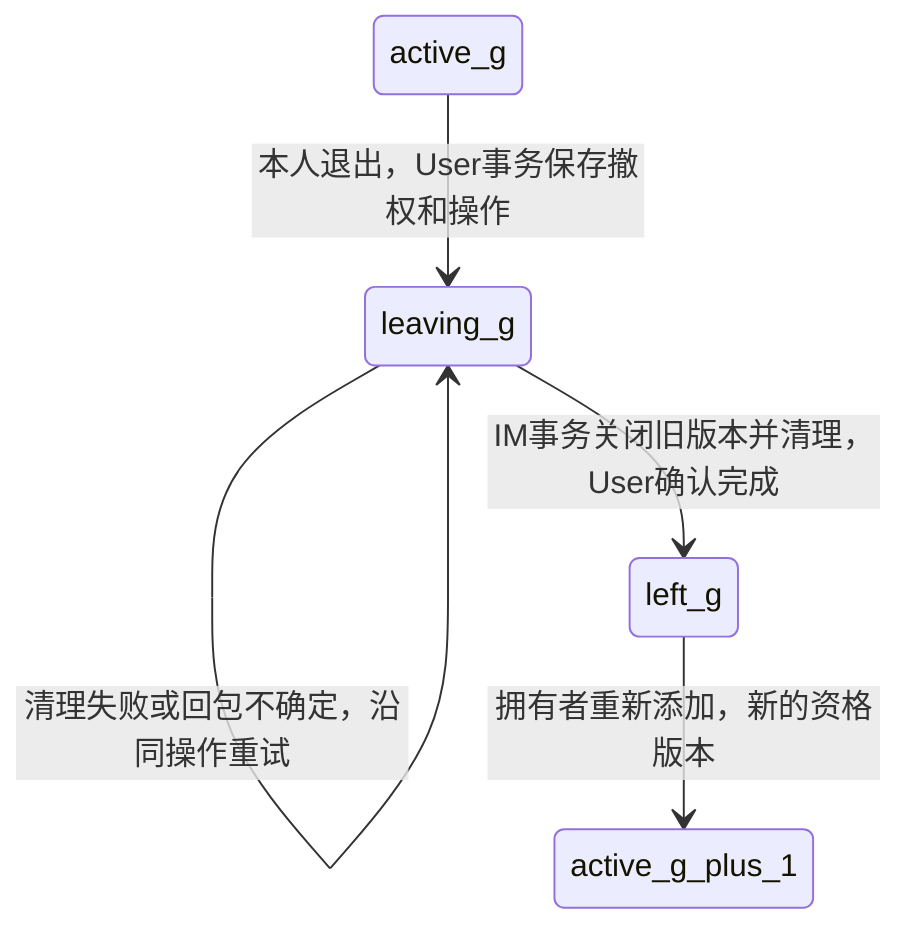

# 阶段7：团队退出、群资格清理与Push核权候选

日期：2026-10-06。原审查快照22640d8，设计保存ad140b8，main仍89e2a1e。用户已逐项明确选择A75/A76/A77全部A：同步清理＋本人恢复、Push专用User核权RPC、非拥有者只退出本人。原候选对比保留作取舍依据，B均未选。正分批建立[资格基础](stage7-team-membership-foundation-contract.md)，退出/恢复入口和清理/投递服务接线尚未完成，不据选择标记A16实现完成。

## 1. 已核对的缺口

| 位置 | 当前行为与缺口 |
| --- | --- |
| [User协议](D:/zy/GoLang/go-im/rpc/user/user.proto:7)、[添加成员](D:/zy/GoLang/go-im/rpc/user/member.go:16) | 没有退出/移除成员接口；仅拥有者可添加启用用户，直接INSERT，重复AlreadyExists |
| [团队表迁移](D:/zy/GoLang/go-im/deploy/mysql/migrations/001_teams.sql:14) | team_members只有team/user/role/joined_at，没有生命周期状态、资格版本或持久退出操作；User当前使用局部结构体，并不存在internal/model/team.go |
| [本人入群](D:/zy/GoLang/go-im/rpc/im/team_group_join.go:29) | 先向User核权，随后独立插group_members；退出清理完成后，之前已通过核权的旧请求仍可能插回资格 |
| [建群主成员](D:/zy/GoLang/go-im/rpc/im/team_group.go:43) | 创建群也会写群主成员记录，不能只保护Join入口 |
| [群访问核权](D:/zy/GoLang/go-im/rpc/im/server.go:45) | 先读取群成员、再问User是否当前团队成员，未区分退出前与重入后的不同资格；旧群快照不能与新团队资格拼接授权 |
| [群Push](D:/zy/GoLang/go-im/internal/push/pusher.go:124)、[名单查询](D:/zy/GoLang/go-im/internal/repository/group_repo.go:86) | 每次从IM数据库查group_members，但不查接收人当前团队资格。残留旧行会进入在线发送或离线保存 |
| [旧WS内部聊天入口](D:/zy/GoLang/go-im/internal/ws/server.go:143) | 查对应连接后入队，没有当前团队/群核权；已经进入队列的消息不能靠删数据库记录撤回 |
| [离线拉取](D:/zy/GoLang/go-im/rpc/im/offline_messages.go:45) | A74已在读取时过滤当前资格，拒绝项保留；不等于在线投递已核权或退出清理已实现 |
| [普通目标核权](D:/zy/GoLang/go-im/rpc/user/team_member_target.go:21)、[UserTrigger](D:/zy/GoLang/go-im/rpc/user/trigger_team.go:25) | 前者需要登录Token；后者专用mTLS只接受IM身份。Push不能伪造本人、借用IM证书或得到整个Agent触发接口权限 |

以上是静态代码证据，未运行真实退出/投递实验。原来的Go/353项Node通过是上批成果，不是本轮退出能力验证。

## 2. A75：退出恢复方式与共同正确性基础

推荐A：持久退出状态＋单调资格版本＋IM持久关闭记录，同步清理，本人显式重试。备选B在同样正确性基础上新增Outbox/Kafka后台自动恢复。资格版本只用来保护并发，并不把A16改成“重入自动恢复旧群”。

| 方案 | 实际行为 | 代价 |
| --- | --- | --- |
| A 同步清理，显式恢复（用户已选择A） | User先保存撤权/退出意图，释放事务锁后调用IM清理；失败保留待清理，本人查状态、重试原操作。清理成功事实在User确认后才允许再次加入团队 | 需要迁移、协议和状态/重试入口；无人重试时不会自动清理完成，不能宣称失败时未撤权 |
| B 自动恢复（未选择） | User撤权与Outbox同事务，经Kafka通知执行清理，可靠保存并回传完成事实；恢复后自动推进 | 另需发布器、消费者、完成回传、退避和配置验证；Kafka ACK/offset不等于IM清理完成 |
| 简单DELETE＋一次RPC（不推荐） | 删团队成员后直接删所有群成员 | 崩溃后无恢复意图；旧Join晚写，旧清理可误删新群资格，不能满足A16 |

候选共同存储方案：保留team_members行并加active/leaving/left及单调generation；独立持久退出操作保存原request_key、operation_id和固定退出版本，以便本人已经离队后仍可凭账户身份查询/重试。版本和操作不得随活动资格删除。已有成员初始化版本，既有无状态查询必须同步升级。备选保留现有活动成员表、另建生命周期表，可以保留部分旧查询形式，但所有加入/退出/核权仍需一致读写生命周期，双表同步更复杂，当前不推荐。表与字段尚未定稿或生成。

User权限关闭以active为准，不能只改CheckTeamMember：拥有者操作、成员目录、角色修改、指定目标核权、姓名候选、后台触发资格和候选SQL均需排除leaving/left。所有再次加入入口，包括拥有者AddTeamMember，必须检查前次清理已确认；重入版本递增，旧操作重试不能被解释为退出当前新版本。

IM推荐保存每个(team_id,user_id)的单调closed_through_generation，作为持久关闭记录，不重入时清零。Join、建群写群主和清理在各自IM短事务中锁同一记录：

1. Join使用User已验证的当前活动版本，只有该版本大于已关闭版本才写群成员。
2. 清理固定退出版本，同一事务推进关闭版本并删除该团队该人的群成员；旧版本重复清理只回显已有完成，不再无条件删除。
3. User只按固定操作/版本条件保存完成，清理未完成拒绝重入。新一代入群仍需本人显式动作，迟到的旧Join不能重新打开资格。
4. 群读取/后台核权重新核对同一活动版本与IM当前状态；不能沿用退出前读取的旧成员快照。跨检查期间版本变动时拒绝或要求重试。

备选为group_members添加版本，并在全部用户/后台出口比较User当前版本。但单独使用会留下清理后迟到插入的无效旧行；若要求物理清理完成仍需关闭屏障。推荐IM一行关闭记录、统一所有团队群成员写入，减少扩散到群成员每行的版本逻辑。不得持User/IM SQL锁等待跨服务RPC。

退出操作查询/重试只验本人账户和操作归属，不能要求仍有团队资格；否则一旦撤权就无法恢复。原消息、离线投递、任务/通知及A73阅读凭据保持原归属，退出清理不删除阅读时间。旧非团队群不受团队清理影响。旧孤立群成员的迁移处理须按实际数据核对，不将初始版本回填当作自动授权。

## 3. A76：后台Push核权入口

共同建议使用已用的专用双向TLS机制，独立Push/User身份及精确SAN，复用rpcauth实现，不借用Agent、IM或通知证书的权限。User→IM清理另有只允许User身份的受限方法，不能把普通客户端自报user_id当删除授权。

| 方案 | 链路与职责 | 取舍 |
| --- | --- | --- |
| A 专用User投递资格RPC（用户已选择A） | Push作为IM内部Worker，从持久IM群/名单获取团队与接收人，再以专用Push mTLS请求User当前活动资格和版本；IM当前群/关闭记录仍由IM组件核对 | 一个跨服务核权调用；新增只读受限协议/配置，依赖User可用性；不得返回资料/姓名解析能力，不能让Push直接读User表 |
| B Push→IM授权RPC（未选择） | Push传持久消息ID及受限接收人范围，IM从已保存消息/群派生团队、核对群成员，再以受限IM身份查User | 权限组合集中在IM，但多一次服务跳转，需新IM受控入口及User核权方法；不能直接扩大UserTrigger的触发范围 |

两方案都必须覆盖在线发送和离线保存：明确当前资格拒绝则跳过该人，不落新离线投递；超时/服务/证书/非法回包失败不放行、不伪装离线或撤权，交现有消费者重试同一消息。部分成功重试沿A19的msg_id去重，不增加逐人恰好一次承诺。每次投递核权会增加调用成本，方法须有超时和严格响应范围；当前群名单查询没有人数上限，不能把超限截断当作全群成功。具体执行上限/分批在共同契约明确，批量接口、缓存授权等如需改变方案应另行说明。

User撤权、核权与实际WS写出仍不是一个分布式原子事务。退出完成不能撤回已经入队或收到的消息，离队前已核权的在途操作可跨越撤权时间；不得承诺瞬时零窗口。是否进一步升级旧聊天Push→WS鉴别/最终交付复核须单独说明，不把新增User核权冒充旧入口已完成mTLS改造。新方法必须单独注册/限制身份，不直接放宽现有UserTrigger。

## 4. A77：首版谁能退出

推荐A：普通成员/管理员只能退出本人；团队拥有者暂不能退出，待将来明确所有权转让或解散。备选B：在本人退出之外允许拥有者移除非拥有者，需要目标核权、固定目标版本和额外测试。现有角色更新不支持转让，首版不隐式选新拥有者，不删除其团队或群。

用户明确选择A，实施仅开放非拥有者本人退出；B未选择，不扩大为拥有者移除或转让功能。

## 5. 后续实现影响与验证目标

选定后root负责共同协议/生成/迁移、方案记录及提交，再从统一快照派三个独立worktree做明确任务。预计分批实现User生命周期/恢复、IM事务屏障/清理、Push当前资格，以及Gateway/原生退出状态入口；不在本轮一次铺完。允许文件在每批共同契约列明。

必要验证窗口：撤权已提交后崩溃、IM清理已提交但回包丢失、旧Join/建群写主晚到、清理重放跨重入、旧退出请求不得退出新版本、本人已撤权仍能恢复、后台User故障不在线/离线放行、原阅读凭据保留。先本机依赖替身验证契约，再最终统一验收真实MySQL/TLS/浏览器/云端。现在没有运行这些测试或执行迁移。

## 6. 本轮只读审查与实际修改

三个子Agent仅只读相同root快照22640d8：User生命周期、Push后台授权、IM并发清理；没有在旧worktree写实现、运行测试或Git动作。root复核结果后只新增本方案并更新架构决策/项目计划/协作记录，共4份文档。原审查时A75/A76/A77未确定前暂停受影响实现；现已确认，分批实施基础，依据[AGENTS.md](D:/zy/GoLang/go-im/AGENTS.md:10)中的关键选型先讨论要求。

实际文件：[本方案](D:/zy/GoLang/go-im/docs/stage7-team-leave-design.md:1)、[候选决策](D:/zy/GoLang/go-im/docs/architecture-decisions.md:422)、[当前计划](D:/zy/GoLang/go-im/docs/project-plan.md:7)、[只读协作记录](D:/zy/GoLang/go-im/docs/worktree-collaboration-plan.md:510)。没有生产代码、协议/生成、迁移或依赖变化；没有新测试、main合并、push/部署。静态审查不等于A16退出业务已完成。
